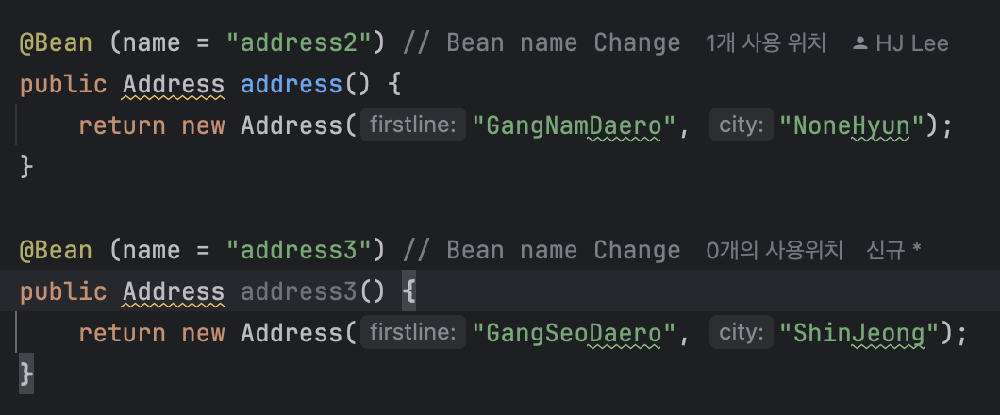

# 노트

## 1 - Java Spring Framework가 필요한 이유 

### 애플케이션 아키텍처의 발전 
Wep App -> REST API -> Full Stack -> Microservices

### 애플리케이션 구축을 위한 프레임워크
* Spring MVC
* Hibernate
* Spring Security
* Spring Data
* Spring Cloud

### Spring 프레임 워크
* 의존성 주입, 자동 연결 지원
* 훨씬 적은 코드로 더 많은 일을 할 수 있도록 한다.

### Spring 프레임 워크와 밀접하게 연관된 용어
* 강한 결합 (Tight Coupling)
* 느슨한 결합 (Loose Coupling)
* 의존성 주입 (Dependency Injection)
* IOC 컨테이너 (IOC Container)
* 애플리케이션 컨텍스트 (Application Context)
* Spring Bean
* 자동 연결 (Auto Wiring)
* 컴포넌트 스캔 (Component Scan)

## 프로젝트 구축 및 Maven, Spring framework 프로젝트 생성하기

## 4
* 마리오 게임 구현

## 5
* 강한 결합
    * 무언가를 변경하는 데 얼마나 많은 작업이 관련되어 있는지의 척도
    * 마리오 게임 대신 수퍼콘트라 게임으로 실행하려면 특정 클래스에서 많은 변화를 주어야 한다.
    * 예를 들어, 차의 엔진은 차와 강하게 결합되어있지만, 바퀴는 차에 느슨하게 연결되어있다.
        * 타이어 바람이 빠진다면, 쉽게 바꿀수 있는 것!
        * 유사한 예로 노트북 vs. 데스크탑
    * 가능한 한 코드를 적게 변경하면서 기능을 변경할 수 있어야 한다 -> 느슨한 결합!

## 6
* 느슨한 결합 만들기
    * 이전 방식은 GameRunner -> MarioGame or SuperContraGame
    * 느슨한 결합 방식 GameRunner -> Gaming Console -> MarioGame or SuperContraGame
        * 중간에 Gaming Console 이라는 interface를 활용해서 느슨한 결합을 만들어주는 것
        * 콘솔에 여러가지 게임을 갈아끼는 것!

## 7
* GamingConsole interface 즉, game들은 결국엔 GameRunner 클래스의 의존성이다.
* Mario, SuperContra, Pacman Game들은 모두 JVM (Java Virtual Machine) 에서 생성되며, 이러한 객체를 생성하고 결합하는 코드는 우리가 작성을 한다.
* 우리 대신 스프링 프레임워크가 해당 작업을 관리하는 것은 어떨까? (의존성 주입 Dependencies Injected)

## 8
* Spring 컨텍스트 실행
* Spring Framework가 관리할 수 있도록 설정
    * HelloWorldConfiguration -> @Configuration
    * method name -> @Bean
* Spring Container에 의해 Bean이 관리되어진다.

## 9
* 더 많은 Bean 생성
* record를 사용하면 게터 및 세터 생성자들을 만들 필요가 없어진다!

## 10
* Bean에서 필요에 따라 기존의 메서드 네임이 아닌 이름을 커스터마이징 할 수 있다.
~~~
// HelloWorldConfiguration.java
@Bean (name = "address2")

// App02HelloWorldSpring.java
System.out.println(Context.getBean("address2")); // address in Address Class type (Available Change Bean name)
~~~
* 이름이 아닌, 클래스로도 호출이 가능하다.
~~~
// App02HelloWorldSpring.java
System.out.println(Context.getBean(Address.class)); // Call Address class 
~~~
* 또한 Configuration에서 method로 return을 받을 수 있다. (Class를 추가)
* 매개변수를 설정해서 받을 수 있다.

## 11
### 우리가 할 수 있는 질문.
* Spring Container, Spring Context, IOC Container, Application Context
* Java Bean, Spring Bean
* Spring 프레임워크가 관리하는 빈의 리스트를 보려면 어떻게 해야할까?
* 여러 개의 Bean을 사용할 수 있다면 어떻게 될까?
~~~
// ex
System.out.println(Context.getBean(Address.class));
// Bean은 원래 싱글톤 배치를 한다, 하지만 2개 이상의 Bean이 보이면 에러를 보낸다.
~~~

// error ->  expected single matching bean but found 2: address2,address3
* 우리가 아닌, Spring이 객체를 만들게 하면 어떨까 ?

## 12
### Spring Container
* Spring 컨테이너는 애플리케이션에 필요한 Bean을 생성하고, 의존성 주입, Bean의 생명주기 관리
* Spring Container의 입출력
    * 입력
        * Java Class 및 설정 (Configuration)
        * 설정은 XML, Java Config(@Configuration), 또는 어노테이션 기반 작성 가능
    * 출력
        * 애플리케이션 실행에 필요한 준비된 시스템
        * JVM 내에서 모든 Bean을 관리하는 Spring 컨텍스트 생성
* Spring Container 동작
    * 설정 및 클래스 등록 : 사용자 Bean 정의와 설정을 제공
    * IOC Container 생성 : 설정 바탕으로 런타임 시스템 만들어지고, Spring Context 초기화
    * Bean 관리 : 의존성 주입 및 생명주기 관리
* Spring Container 종류
    * Bean Factory
        * Basic Spring Container
        * 메모리에나 리소스가 제한된 환경 (ex. IOT 애플리케이션)에서 사용
        * 현재는 잘 사용되지 않음
    * Application Context
        * Advanced Spring Container (Enterprise)
        * Bean 관리, AOP, 이벤트 처리, 메시지 소스 관리 등의 기능 포함
        * 가장 많이 사용됨

## 13
### Java Bean, Pojo, Spring Bean
* Pojo
    * 일반적인 Java 객체
~~~
class Pojo {
    private String text;
    private int number;

    public void toString() {
        return text + " : " + number;
    }
}
~~~
* EJB (Enterprise Java Bean)
    * 기본적으로 인수 생성자가 존재하지 않는다.
    * 게터와 세터가 있어야 한다.
    * implements Serializable
~~~
class JavaBean implements Serializable{ // EJB
    private String text;
    private int number;
}
~~~

* Spring Bean
    * Spring이 관리하는 모든 Java 객체.

## 14
### Spring Framework Bean 자동연결  
* Spring Bean 이름 리스트 나열
    * context.getBeanDefinitionNames() 활용
~~~
Arrays.stream(context.getBeanDefinitionNames())
        .forEach(System.out::println); // 함수형 프로그래밍 (메서드 참조)
~~~
* 여러개의 Bean이 일치하는 경우
    * @Primary 기본값으로 설정하여 해결할 수 있다.
    * @Qualifier를 활용하여 한정지어서 해결할 수 있다.

## 15
### Gaming Application 
* 기존 만들었던 Game Application Spring Context 생성하기

## 17
* 강한 결합
* 느슨한 결합
* Interface
* Spring Container
* Application Context
* Basic Annotation
* @Configuration
* @Bean
* Auto-wiring
* Java Bean vs. Spring Bean