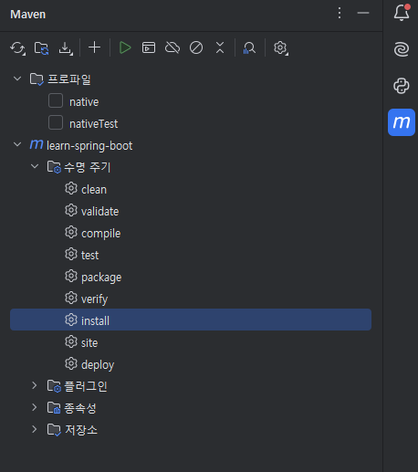
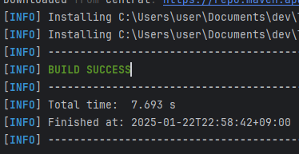
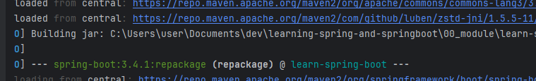
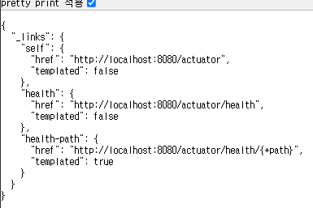

# 노트

## 1. Getting Started with Spring Boot
* Why Spring Boot?
* Spring Boot의 목표
* Spring Boot 프레임워크 작동은 어떻게 ?
* Compare Spring Boot, Spring MVC, Spring

## 2. Spring Boot 이전 세계 이해하기
* Spring Boot 이전에 Spring Project를 설정하는 것은 쉽지 않았다.
    1. Dependency Management (pom.xml)
    2. Define Web App Configuration (web.xml)
    3. Spring Configuration (Manage Spring Beans)
    4. NFRs 

## 3. Spring Initializr
* Snapshot version은 개발 중인 버전
* Dependencies
    * Spring Web
        * Spring MVC로 웹 애플리케이션과 REST API를 빌드하는 데 사용

## 4. Hello World API Build // package CourseController
* 간단한 Rest API 구축
* RestController
    * 해당 클래스가 REST API 컨트롤러 임을 나타낸다.
* RequestMapping("/url")
    * url 경로로 들어오는 HTTP 요청을 해당 메서드로 매핑
    * GET 요청과 연결
    * /url에 요청을 보내면, Mapping을 선언한 메서드가 실행됨

## 5. Spring Boot의 목표 이해하기
* Spring Boot의 가장 중요한 목표는 프로덕션 환경에서 사용 가능한 애플리케이션을 빠르게 빌드할 수 있도록 돕는 것.
    * Build
        * Spring Initializr
        * Spring Boot Starter Projects
        * Spring Boot Auto Configuration
        * Spring Boot DevTools
    * Production-Ready
        * logging
        * Different Configuration for Different Environments
        
## 6. Spring Boot Starter Projects
* Build a REST API
* Write Unit Tests
* Talk to database using JPA
* Talk to database using JDBC
* Spring Boot가 다양한 Starter Project를 제공한다.

## 7. Spring Boot Auto Configuration
* 일반적으로 Spring Boot를 사용하여 웹 애플리케이션을 빌드할 때, 많은 설정이 필요함.
    * Conponent Scan, DispatcherServlet, Data Sources, JSON Conversion, ...
* Auto Configuration으로 간단화 할 수 있다.
    * 클래스 경로에 있는 프레임워크에 따라 많은 것들을 자동 설정할 수 있다.
    * Spring Boot는 디폴트 자동 설정을 제공
* 모든 Auto Configuration 로직은 Maven Dependencies 에서 확인
* application.properties -> logging.level.org.springframework=debug -> 로그기록을 확인 (CONDITIONS EVALUATION REPORT -> Positive, Negative)
    * Positive matchs -> 자동 설정된 항목
    * Negative matchs -> 자동 설정되지 않은 항목
* Spring Boot Starter Web
    * Dispatcher Servlet, Embedded Servlet Container

## 8. Build Faster with Spring Boot DevTools
* 개발자의 생산성을 올려준다.
* 코드를 변경할 때마다 수동으로 서버를 재시작 해야할까 ?
* 의존성을 추가하면 된다 !

## 9. Spring Boot로 프로덕션 환경 배포 준비하기 (Profile)
* Profile을 사용, 애플리케이션 설정을 관리
* 애플리케이션에는 다양한 환경이 존재
    * Dev
    * QA
    * Stage
    * Production
* 동일한 애플리케이션의 다양한 환경에는 다양한 설정이 필요.
    * Database
    * Web Services
* Profile을 통해 환경별 설정을 제공할 수 있다.
    * application.properties를 dev, prod 등으로 복사하여 작성.

## 10. Spring Boot로 프로덕션 환경 배포 준비하기 2 (ConfigurationProperties) // CurrencyServiceConfiguration, CurrencyConfigurationController
* 설정 Properties를 클래스로 관리할 수 있다
* @ConfigurationProperties Annotation 사용
    * prefix option 사용
    * getter, setter 사용
    * Rest Controller를 활용하여 Autowired로 의존성을 주입
    * Mapping한 페이지로 가면 설정 값이 뜬다.

## 11. Spring Boot로 프로덕션 환경 배포 준비하기 3 (Embedded Server)
* 개발자들은 배포 프로세스가 매우 간단하기를 바란다.
* 어떻게 배포하나?
    * 자바 설치
    * Web / Application Server 설치 (e.g. Tomcat)
    * Web Archive에 배포 (WAR)
        * 이전 방식
        * 설정하기에 복잡하다.
* Embedded Server의 컨셉은 WAR에 대비해 더 단순한 대안
    * Tomcat과 같은 서버가 JAR 파일에 포함되어 있기 때문이다.
    * 자바를 설치하기만 하면 JAR 파일을 실행할 수 있다.
    * Maven > 수명 주기 > Install
    
    * Build Success 확인
    
    * Maven Building jar route 확인
    
    * 터미널에서 jar 파일을 실행시켜 애플리케이션을 실행시킬 수 있다.
        * 단, 올바른 자바 버전이 설치가 되어 있어야 한다.

## 12. Spring Boot로 프로덕션 환경 배포 준비하기 4 (Actuator) 
* Spring Boot Actuator는 여러개의 엔드포인트를 제공
    * Beans : 애플리케이션에 포함된 모든 Spring beans 확인 
    * health : 애플리케이션이 제대로 작동하는 지 확인 (상태 정보)
    * metircs : 애플리케이션의 여러가지 metrics 제공
    * mappings : 모든 Request Mappings 관련 세부 사항 확인

~~~
<dependency>
    <groupId>org.springframework.boot</groupId>
    <artifactId>spring-boot-starter-actuator</artifactId>
</dependency>
~~~
* <code>spring-boot-starter-actuator</code> 라이브러리 추가
* /acuator 엔드포인트 이동

* /acuator/health 이동
    * Status 확인
* 기본적으로는 /health만 노출
* 추가적으로는 <code>application.properties</code> 에서 설정
    * 더 많은 endpoint를 볼 수 있다.
~~~
management.endpoints.web.exposure.include=*
~~~
* 주요 acuator 엔드포인트
    * /acuator/beans : 모든 Spring Beans 표시
    * /acuator/configprops : <code>application.properties</code> 에서 설정할 수 있느 모든 항목 표시
    * /acuator/env : 환경에 관한 세부 사항 표시
    * /acuator/metrics : 반환된 metrics 목록 표시
        * /acuator/metrics/http.server.requests 방식으로 세부 항목을 볼 수 있다.
        * Count는 요청 처리할 때마다 올라감 (새로고침하면 올라간다.)
* 너무 많은 엔드포인트를 설정하면, CPU와 메모리 사용량이 높아진다.
* 엔드포인트 사용할 것만 지정해주는 것이 좋다.
~~~
management.endpoints.web.exposure.include=health,metrics
~~~

## 13. Spring Boot, Spring, Spring MVC 이해하기
* 스프링 프레임워크는 의존성 주입이 전부이다.
    * @Component, @Autowired, @ComponentScan, etc ...
    * 스프링 모듈과 스프링 프로젝트는 스프링 생태계를 확장시킨다.
        * 다른 프레임워크와 쉽게 통합할 수 있도록 지원한다.
* 스프링 MVC : 스프링 모듈, 웹 애플리케이션과 REST API의 빌드 과정을 간소화
    * @Controller, @RestController, @RequestMapping("/course")
* 스프링부트 : 스프링 프로젝트, 프로덕션 환경에 사용 가능한 애플리케이션을 빠르게 빌드하도록 지원한다.
    * Starter Projects, Auto configuration
    * NFRs 사용가능
        * Actuator
        * Embedded Server
        * Logging, 에러 처리
        * Profile, @ConfigurationProperties

## 14. Spring Boot 시작하기 - 복습
* 스프링 부트의 주요 용어
    * Starter Projects
    * Auto Configuration
    * Actuator
    * DevTools
* 스프링 부트의 장점
    * 프로덕션 환경에 사용 가능한 기능을 빠르게 시작