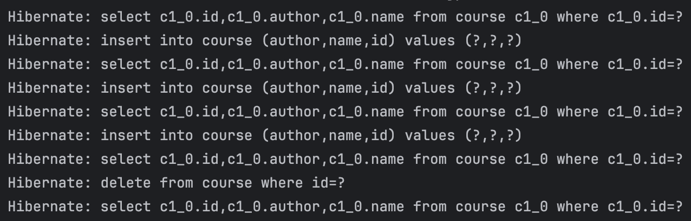
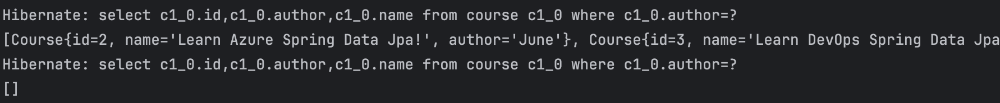

# 노트

## 1. Getting Started with JPA and Hibernate
* 간단한 JPA App을 build (Spring Boot 사용)
* 직접해보면서 JPA, Hibernate를 배움.
* JPA 이전 세계 이해
    * JDBC, Spring JDBC
* 차이점
* Learning JPA and Hibernate
    * H2를 DB로 사용, Spring Boot 프로젝트 생성
    * H2 Database에 COURSE Table 생성 
    * Spring JDBC를 사용하여 Table 데이터 활용
    * Spring Data JPA

## 2. JPA와 Hibernate에 맞는 새 Spring Boot 프로젝트 생성
* Spring Boot 3에는 최소 Java 17 버전이어야 호환된다
* Add Dependencies
    * Spring Web
    * Spring Data JDBC
    * Spring Data JPA
    * H2 Database
        * 적은 용량이 빠른 인메모리 데이터베이스 제공

## 3. H2 콘솔 실행하기 및 H2에서 테이블 생성하기
* 프로젝트를 만든 후, 실행하면 H2 Database url이 뜬다
* 해당 url은 실행할 때마다 변경이 되므로 확인!
* 
* <code>application.properties</code>에 설정 추가
~~~
spring.h2.console.enabled=true
~~~

* 재 실행 후 "/h2-console" 이동

* JDBC URL을 입력 후, Connect 하면 DB 화면으로 이동된다.

* JDBC URL 같은 경우 실행 때마다 url이 바뀌어 번거롭다
    * <code>application.properties</code>에 설정을 추가하면 고정된 url로 진행 가능 
~~~
spring.datasource.url=jdbc:h2:mem:testdb
~~~

* <code>resources</code> 디렉토리에 <code>schema.sql</code> 파일 생성 후, Table 정의
~~~
create table course
(
    id bigint not null, -- bigint > long
    name varchar(255) not null,
    author varchar(255) not null,
    primary key (id)
);
~~~

* 이후 재실행하면 table이 생긴것을 알 수 있다.

## 4. Spring JDBC 시작하기.
* Table에 데이터를 넣어보자
~~~
insert into course (id, name, author)
values(1, 'Learn AWS', 'Hyun')
~~~

* JDBC, Spring JDBC를 쓸때는 SQL쿼리를 작성해서 데이터를 조작한다.
    * Spring JDBC로는 Java 코드를 더 적게 써야한다.
* H2 콘솔의 데이터가 서버를 재시작할 때마다 새로고침이 된다.

## 5. Spring JDBC를 활용하여 데이터 삽입하기
* <code>course.jdbc</code> package 생성
    * 해당 패키지 안에 Repository 클래스 생성
* <code>CourseJdbcRepository</code> 클래스
~~~
@Repository // DB 연결
public class CourseJdbcRepository {

    @Autowired
    private JdbcTemplate springjdbcTemplate;

    private static String INSERT_QUERY =
            """
                insert into course (id, name, author)
                values(1, 'Learn AWS', 'Hyun');        
            """;

    public void insert() {
        springjdbcTemplate.update(INSERT_QUERY);
    }
}
~~~
* 애플리케이션 시작 단계에 해당 쿼리를 실행시키려면 어떻게 해야할까? 
    * CommandLineRunner를 구현한다
* CommandLineRunner
    * Bean이 스프링 애플리케이션안에 포함되어있을때 실행된다는 의미로 쓰이는 인터페이스
* <code>CourseJdbcCommandLineRunner</code> 클래스
~~~
@Component // 실행 시, 컴포넌트로 확인할 수 있도록 지정
public class CourseJdbcCommandLineRunner implements CommandLineRunner {

    @Autowired
    private CourseJdbcRepository repository;

    @Override
    public void run(String... args) throws Exception {
        repository.insert(); // repository class안에 있는 insert class를 실행
    }
}
~~~
* 애플리케이션을 실행하면 자동적으로 쿼리가 실행되어진다.

## 6. Spring JDBC를 활용하여 데이터 삽입 및 삭제하기.
* <code>Course</code> 패키지에 <code>course</code> 클래스 생성
~~~
public class Course {
    private long id;
    private String name;
    private String author;

    생성자, Getter, toString 메서드
}
~~~

* <code>CourseJdbcRepository</code> 클래스
~~~
@Repository // DB 연결
public class CourseJdbcRepository {

    @Autowired
    private JdbcTemplate springjdbcTemplate;

    // Query 변수 지정
    private static String INSERT_QUERY =
            """
                insert into course (id, name, author)
                values(?, ?, ?); // 물음표를 지정하여 입력변수로 받는다.  
            """;

    // 매개변수 추가 (Course)
    public void insert(Course course) {
        springjdbcTemplate.update(INSERT_QUERY, course.getId(), course.getName(), course.getAuthor());
    }
}
~~~
* <code>CourseJdbcCommandLineRunner</code> 클래스
~~~
@Component // 실행 시, 컴포넌트로 확인할 수 있도록 지정
public class CourseJdbcCommandLineRunner implements CommandLineRunner {

    @Autowired
    private CourseJdbcRepository repository;

    @Override
    public void run(String... args) throws Exception {
        repository.insert(new Course(1, "Learn", "June")); // repository class안에 있는 insert class를 실행
    }
}
~~~

* Additional
* Delete를 하고 싶으면?
* <code>CourseJdbcRepository</code> 클래스
* 삭제 쿼리 및 삭제 클래스 추가
~~~
private static String DELETE_QUERY =
        """
            delete from course where id = ?;
        """;

public void deleteById(long id) {
    springjdbcTemplate.update(DELETE_QUERY, id);
}
~~~
* <code>CourseJdbcCommandLineRunner</code> 클래스
~~~
repository.deleteById(1);
~~~
* 재 실행

## 7. Spring JDBC를 사용하여 쿼리로 데이터 불러오기
* 데이터를 DB에서 불러오는 것은 DB 데이터를 반환받기 때문에 Course를 반환받는다.
* <code>CourseJdbcRepository</code> 클래스
~~~
// Course라는 타입의 객체를 반환한다.
public Course findById(long id) {
    return springjdbcTemplate.queryForObject(
            SELECT_QUERY,
            // ResultSet -> Bean => Row Mapper
            // Row Mapper는 결과 세트의 각 행을 특정 Bean에 연결해준다.
            // Course.class -> Course 클래스를 나타내는 클래스 객체, 매핑 과정에서 사용한다
            new BeanPropertyRowMapper<>(Course.class),
            id
    );
}

// Course라는 타입의 객체를 List에 담은 것을 반환한다.
// db 전체 데이터를 확인하는 것.
public List<Course> findAll() {
    return springjdbcTemplate.query(
            "select * from course",
            new BeanPropertyRowMapper<>(Course.class)
    );
}
~~~

* <code>Course</code> 클래스
~~~
// 기본 생성자 (findById에서 매핑하기 위한 기본 생성자)
public Course () {}

// Setter (매핑을 위한 기본 세터, 자동으로 setter와 매핑해준다.)
public void setId(long id) {
    this.id = id;
}

public void setName(String name) {
    this.name = name;
}

public void setAuthor(String author) {
    this.author = author;
}
~~~

* <code>CourseJdbcCommandLineRunner</code> 클래스
~~~
System.out.println(repository.findById(3));

repository.findAll().forEach(
        System.out::println
);
~~~

* <code>BeanPropertyRowMapper</code>
    * JDBC에서 반환된 ResultSet의 각 행을 지정된 클래스의 객체로 매핑하는 역할
    * 내부적으로 리플렉션을 사용하여 Course 객체를 생성한다
    * 리플렉션을 통해 객체를 생성할 때, 기본적으로 매개변수가 없는 생성자를 호출한다.
    * 리플렉션을 써서 세터를 자동으로 호출해 값을 넣어서 출력해준다.

## 8. JPA와 EntityManager 시작하기
* Spring JDBC를 활용할 때, Java 코드는 간단한 데 비해, 쿼리는 복잡해질 수 있다.
    * 시간이 지나면서 테이블을 점점 더 가져올수록 쿼리 작성은 복잡해진다.
    * 그래서 JPA가 다른 접근 방식을 사용한다.

* JPA를 사용하게되면, Course를 데이터베이스에 존재하는 테이블로 직접 매핑하게 된다.
* 직접 매핑하고 생성하는 것을 Entity라고 표현한다.
* <code>Course</code>
* 생성자, 게터, 세터 등이 있는 클래스에 @Entity 추가
~~~
@Entity
public class Course {
    
    @Id // primary key
    private long id;

    @Column(name="name") // 엔터티와 테이블에서 이름이 같기 때문에 name 속성은 필요가 없으나, 예시로 넣어둠
    private String name;

    @Column(name="author")
    private String author;

    생성자, 게터, 세터, toString, ...
}
~~~
* <code>CourseJpaRepository</code>
~~~
@Repository
@Transactional // Entity Manager는 트랜잭션이 필요하다.
public class CourseJpaRepository {

    @PersistenceContext // Autowired를 써도 되지만, 더 구체적인 Annotation 사용.
    private EntityManager entityManager;

    // Course를 매개 변수로 받는다.
    public void insert(Course course) {

        // merge로 Course와 Mapping
        entityManager.merge(course);
    }

    // Course 타입을 반환
    // Course.class -> Course 클래스를 나타내는 클래스 객체, 매핑 과정에서 사용한다
    public Course findById(long id) {
        return entityManager.find(Course.class, id);
    }

    // Delete 방식은 조금 복잡하다
    public void deleteById(long id) {
        // 엔터티를 먼저 찾는다.
        // 이걸 지역 변수에 담는다.
        Course course = entityManager.find(Course.class, id);

        // 해당 엔터티를 remove
        entityManager.remove(course);
    }

    public List<Course> findAll() {
        return entityManager.createQuery("select c from Course c", Course.class).getResultList();
    }
}
~~~

* <code>CourseCommandLineRunner</code> 클래스
    * 기존 JdbcRepo를 주석 처리 후, JpaRepo로 실행.
~~~
@Component // 실행 시, 컴포넌트로 확인할 수 있도록 지정
public class CourseCommandLineRunner implements CommandLineRunner {

//    @Autowired
//    private CourseJdbcRepository repository;
//
    @Autowired
    private CourseJpaRepository repository;

    @Override
    public void run(String... args) throws Exception {
        repository.insert(new Course(1, "Learn AWS Jpa!", "June")); // repository class안에 있는 insert class를 실행
        repository.insert(new Course(2, "Learn Azure Jpa!", "June")); // repository class안에 있는 insert class를 실행
        repository.insert(new Course(3, "Learn DevOps Jpa!", "June")); // repository class안에 있는 insert class를 실행
        repository.deleteById(1);

        System.out.println(repository.findById(3));

        repository.findAll().forEach(
                System.out::println
        );
    }
}
~~~

* jpa 사용 중, 여기에 실행되는 쿼리를 보고 싶다면?
* properties에 옵션을 추가.
* <code>application.properties</code>
~~~
spring.jpa.show-sql=true
~~~

## 9. JPA 살펴보기
* JDBC
    * Query, Java 코드를 많이 작성
* Spring JDBC
    * Query를 많이 작성, Java 코드는 적었다. (하지만 기존 JDBC 보다 적다.)
* JPA
    * Query는 신경쓰지 않고, 엔터티만 테이블로 매핑
    * EntityManager 활용

## 10. Spring Data JPA 시작하기
* Spring Data JPA는 왜 필요할까 ?
    * JPA가 더욱 간단해진다!
    * EntityManager도 신경쓸 필요가 전혀 없다.
        * Spring Data JPA가 알아서 다 해준다.
* Spring Data JPA는 인터페이스를 활용한다.
* <code>CourseSpringDataJpaRepository</code> interface
~~~
// Spring Data JPA를 이용할 때는 인터페이스를 활용한다.
// JpaRepository를 상속받아야 한다.
// <> 어떤 엔터티를 관리할지와, Id Field 넣어줌.
// Id 필드는 Course 클래스에 보면 @Id Annotation이 존재하는 것을 알 수 있다 해당 타입을 넣어준다.
public interface CourseSpringDataJpaRepository extends JpaRepository<Course, Long> {}
~~~
* <code>CourseCommandLineRunner</code> 클래스
    * 기존 Repo를 주석 처리 후, SpringDataJpaRepo로 실행.
~~~
@Autowired
private CourseSpringDataJpaRepository repository;

@Override
public void run(String... args) throws Exception {
    repository.save(new Course(1, "Learn AWS Jpa!", "June")); // repository class안에 있는 insert class를 실행
    repository.save(new Course(2, "Learn Azure Jpa!", "June")); // repository class안에 있는 insert class를 실행
    repository.save(new Course(3, "Learn DevOps Jpa!", "June")); // repository class안에 있는 insert class를 실행

    // Long type인 L을 뒤에 써준다
    repository.deleteById(1L);

    System.out.println(repository.findById(3L));

    repository.findAll().forEach(
            System.out::println
    );
}
~~~

## 11. Spring Data JPA 특징 살펴보기
* <code>CourseCommandLineRunner</code> 클래스
~~~
// 전체 데이터 확인하기
System.out.println(repository.findAll());

// 엔터티의 개수 확인하기
System.out.println(repository.count());
~~~

* custom 메서드를 추가할 수 있다.
    * Repo에 메서드를 추가하고, Runner에 실행하면 된다.
* <code>CourseSpringDataJpaRepository</code> interface
~~~
// author 변수를 지정
// Course 클래스 매핑, 반환된 데이터들을 리스트로 반환
List<Course> findByAuthor(String author);
~~~
* <code>CourseCommandLineRunner</code> 클래스
~~~
// June과 똑같은 author를 찾아준다.
System.out.println(repository.findByAuthor("June"));
System.out.println(repository.findByAuthor(""));
~~~

## 12. Hibernate, jpa 차이 이해하기
* JPA는 기술 명세를 정의한다 즉, API이다.
    * 엔터티가 무엇인지 방식을 정의한다.
    * 엔터티를 매핑하는 방법, 속성을 매핑하는 방법, EntityManager를 활용하는 방법을 정의한다.
* Hibernate
    * JPA에서 가장 인기 있는 구현체
    * 즉 JPA 안에 Hibernate라는 선택지가 존재하는 것!
        * Toplink 등의 다른 선택지가 존재한다.