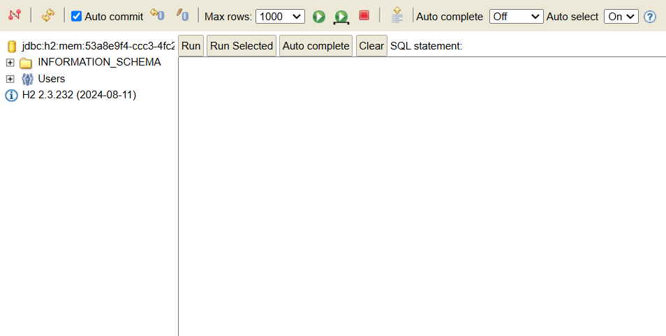

# 노트

## 1. Getting Started with JPA and Hibernate
* 간단한 JPA App을 build (Spring Boot 사용)
* 직접해보면서 JPA, Hibernate를 배움.
* JPA 이전 세계 이해
    * JDBC, Spring JDBC
* 차이점
* Learning JPA and Hibernate
    * H2를 DB로 사용, Spring Boot 프로젝트 생성
    * H2 Database에 COURSE Table 생성 
    * Spring JDBC를 사용하여 Table 데이터 활용
    * Spring Data JPA

## 2. JPA와 Hibernate에 맞는 새 Spring Boot 프로젝트 생성
* Spring Boot 3에는 최소 Java 17 버전이어야 호환된다
* Add Dependencies
    * Spring Web
    * Spring Data JDBC
    * Spring Data JPA
    * H2 Database
        * 적은 용량이 빠른 인메모리 데이터베이스 제공

## 3. H2 콘솔 실행하기 및 H2에서 테이블 생성하기
* 프로젝트를 만든 후, 실행하면 H2 Database url이 뜬다
* 해당 url은 실행할 때마다 변경이 되므로 확인!
* 
* <code>application.properties</code>에 설정 추가
~~~
spring.h2.console.enabled=true
~~~

* 재 실행 후 "/h2-console" 이동

* JDBC URL을 입력 후, Connect 하면 DB 화면으로 이동된다.

* JDBC URL 같은 경우 실행 때마다 url이 바뀌어 번거롭다
    * <code>application.properties</code>에 설정을 추가하면 고정된 url로 진행 가능 
~~~
// 해당 주소로 connect!
spring.datasource.url=jdbc:h2:mem:testdb
~~~

* <code>resources</code> 디렉토리에 <code>schema.sql</code> 파일 생성 후, Table 정의
~~~
create table course
(
    id bigint not null, -- bigint > long
    name varchar(255) not null,
    author varchar(255) not null,
    primary key (id)
);
~~~

* 이후 재실행하면 table이 생긴것을 알 수 있다.
