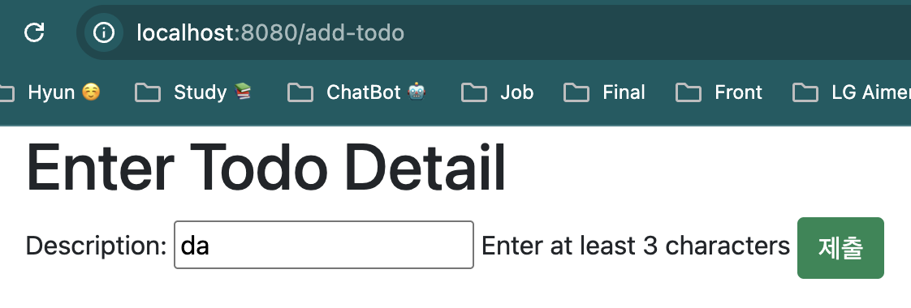

# 노트

## 0. Building First Web Application
* Browser, HTML, CSS, Request, Response, Form, Session, Authentication
* Spring MVC (Dispatcher Servlet, View Resolvers, Model, View, Controller, Validations, ...)
* Spring Boot (Starters, Auto Configuration)
* Frameworks/Tools (JSP, JSTL, JPA, Bootstrap, Spring Security, MySQL, H2)
* To-do Management Web app 구축하기 

## 1. Spring initializr 
* Group ID, Artifact ID 지정
* Dependencies
    * Spring Web > Spring MVC를 이용해서, RESTful을 비롯한 웹 애플리케이션 구축
        * 기본 임베디드 컨테이너는 Apache Tomcat을 사용한다.
    * Spring Boot DevTools > 빠를 애플리케이션 재시작, 라이브 리로드 등 개발 편의성 제공

## 2. Spring boot 프로젝트 간단히 살펴보기
* 프로젝트 구조 확인하기
* `application.properties`
    * 애플리케이션 세부정보 설정
~~~
// 포트 8081로 설정
server.port=8081
~~~
* `pom.xml`
    * dependency
    * Java version 설정 등

## 3. Spring MVC Controller
* RequestMapping > URL mapping 
* ResponseBody > return 한 그대로를 브라우저에 리턴하는 것을 의미한다.
* `SayHelloController`
~~~
@Controller
public class SayHelloController {
    @RequestMapping("say-hello")
    @ResponseBody
    public String sayHello() {
        return "Hello! What are you learning today?";
    }
}
~~~

## 4-1. HTML 응답 제공 위해 Spring MVC 컨트롤러 개선하기
* HTML을 return 하는 메서드
* `SayHelloController`
~~~
@RequestMapping("say-hello-html")
@ResponseBody
public String sayHelloHtml() {
    StringBuffer sb = new StringBuffer();
    sb.append("<html>");
    sb.append("<head>");
    sb.append("<title> My first HTML Page - Changed</title>");
    sb.append("</head>");
    sb.append("<body>");
    sb.append("My first html page with body Changed");
    sb.append("</body>");
    sb.append("</html>");
    return sb.toString();
}
~~~

## 4-2. Code or debugging
* 강의를 들으면서 문제가 발생할 시, 깃허브 링크 참고!
* [in28minutes-github-link](https://github.com/in28minutes/master-spring-and-spring-boot/blob/main/11-web-application/99-step-by-step-changes.md)

## 5. SpringBoot Controller, @ResponseBody, 뷰를 이용하여 JSP로 리디렉션하기
1. `pom.xml`에 dependency 추가
    * tomcat-embed-jasper (jsp파일 해석 및 처리)
~~~
<dependency>
    <groupId>org.apache.tomcat.embed</groupId>
    <artifactId>tomcat-embed-jasper</artifactId>
</dependency>
~~~

2. JSP 파일 생성
    * `src/main/webapp/WEB-INF/jsp` 해당 경로에 jsp 파일 (view)을 넣어서 보관해야 함
    * HTML로 작성

3. `application.properties` 수정
    * 접두사 = prefix
        * /src/main/webapp 까지의 경로는 spring이 이미 알고있음. 
    * 접미사 = suffix
        * 파일의 확장자 (.jsp)
~~~
spring.mvc.view.prefix=/WEB-INF/jsp/
spring.mvc.view.suffix=.jsp
~~~

4. Mapping 추가
    * @ResponseBody 가 있으면 return 되는 String 값을 출력하니 주의!
~~~
@Controller
public class SayHelloController {
    @RequestMapping("say-hello-jsp")
    public String sayHelloJsp() {
    return "sayHello";
    }
}
~~~

## 6. 예제 - LoginController와 login 뷰 만들기 
1. login 패키지에 LoginController 클래스를 만듦
* `src/main/java/com/hyun/springboot/myfirstwebapp/login/LoginController.java`
~~~
@Controller
public class LoginController {

    @RequestMapping("login")
    public String login() {
        return "login";
    }
}
~~~

2. jsp 파일 생성
* `src/main/webapp/WEB-INF/jsp/login.jsp`
* HTML로 컨텐츠 작성

## 7. 웹의 작동 방식 - 요청과 응답
* String으로 반환된 것은 텍스트로만 표시한다.
* html을 리턴하면 브라우저가 그걸 이해하고 표시한다.
* F12 > Network > sayHello.jsp 
    * Request URL > http://localhost:8080/say-hello-jsp
    * Request Method > GET
    * Status Code > 200
* URL을 건드리면, 브라우저가 요청을 전송 
    * HttpRequest
* 우리 서버 or 애플리케이션은 요청을 받으면 그 요청을 처리하게 된다.
    * Spring Boot 웹 애플리케이션이 요청을 받은 후 처리
* 서버 or 애플리케이션이 응답을 return

## 8. RequestParam으로 쿼리 파라미터 잡기, 모델 소개
* 특정한 URL에 정보를 전달하는 가장 쉬운 방법은 쿼리 파라미터를 사용하는 방법이다.
* URL에 쿼리 파라미터를 추가하면 요청은 먼저 해당되는 Controller로 간다
* 이를 @RequestParam 어노테이션을 사용해서 컨트롤러 메서드에서 수학할 수 있다
    * 여기서는 LoginController  
* 이를 Model Mapping을 통해서 jsp파일 (뷰)로 전달할 수 있다.

1. URL에 쿼리 파라미터 추가
    * ?name= 추가
~~~
http://localhost:8080/login?name=hyun
~~~

2. Controller에 RequestParam 어노테이션 추가
~~~
@RequestMapping("login")
public String loginPage(@RequestParam String name) {
    System.out.println("Request param is : " + name);
    return "login";
}
~~~
3. 결과

4. login.jsp에서 param을 사용하려면?
* 여기서 중요한 개념인 모델(Model)이 등장한다.
    * 컨트롤러에서 jsp로 전달하려할 때, 파라미터를 모델에 넣어서 전달할 수 있다.
* Spring MVC가 제공하는 옵션 중에는 ModelMap이 존재.
* @RequestParam 과 전달하려는 변수 타입과 변수이름을 설정
* ModelMap을 활용, put으로 name을 전달한다.
* jsp 파일에 변수를 저장한다.
~~~
public class LoginController {

    // http://localhost:8080/login?name=hyun
    @RequestMapping("login")
    public String loginPage(@RequestParam String name, ModelMap model) {
        model.put("name", name);
        System.out.println("Request param is : " + name);
        return "login";
    }
}
~~~
* `login.jsp`
~~~
<html>
    <head>
        <title>Login page</title>
    </head>
    <body>
        Hello this is Login Page ${name}!
    </body>
</html>
~~~
* 결과

## 9. Spring Boot를 사용할 때 로깅의 중요성
* Spring Boot 에서는 `application.properties` 를 통해 로깅을 설정할 수 있다.
* debug, info, trace, error, warn 등의 레벨이 있다.
#### 클래스를 선택해서 로깅 하기
~~~
#application.properties

logging.level.org.springframework=info
logging.level.com.in28minutes.springboot.myfirstwebapp=debug
~~~
* `logging.level.` 이후에 패키지를 입력, 특정 패키지의 로깅 범위를 지정할 수 있다.

#### slf4j를 사용해서 로깅 하기
* `System.out.println()`을 활용해서 터미널에 로깅을 해왔지만 Logger를 사용해서 로깅할 수 있다.
~~~
import org.slf4j.Logger;
import org.slf4j.LoggerFactory;

@Controller
public class LoginController {

    private Logger logger = LoggerFactory.getLogger(getClass());
    @RequestMapping("login")
    public String loginPage(@RequestParam String name, ModelMap model) {
        model.put("name", name);
        System.out.println("Request param is : " + name);
        logger.debug("Request Param is {}",name);
        return "login";
    }
}
~~~
* `private Logger logger = LoggerFactory.getLogger(getClass());`
    * Logger 선언
* debug()
    * Logger의 메서드
    * info, warn으로 바꿔도 가능하다 (해당 레벨에 맞춰서 로깅이 된다.)
    * {}을 기준으로 변수를 넣어주면 된다 (printf를 생각하면 편할 듯)
* 사진을 보면, println처럼 나오는 것이 아닌, logging이 나오는 것을 알 수 있다.

* spring에서는 로깅을 권장하는 편이다.

## 10. 디스패치 서블릿, 모델1, 모델2, 프론트 컨트롤러 알아보기
#### 웹 애플리케이션 개발의 역사

* 뷰에 모든 코드를 작성 (jsp) / 컨트롤러가 존재하지 않음
    * View 로직 : 페이지를 표시하는 방법 (HTML, CSS)
    * Flow 로직 : 페이지를 표시하는 방법에 (페이지 순서 등) 관한 로직 
    * 데이터베이스 쿼리 : 데이터베이스와 상호작용을 위한 쿼리 (SQL 쿼리)
        * 이를 화면에 표시해야 했다.
* 단점
    * 너무 복잡하다 
    * 주제별로 구분되지도 않았음
        * 뷰, 흐름, 데이터베이스 로직 등 모든 것이 jsp 안에 존재
    * 유지 보수의 어려움

* 주제별로 분명하게 구분됨
    * Model : View를 생성하는 데 사용하는 데이터 
    * View : 정보를 사용자에게 보여주는 역할 
    * Controller : 전체 흐름 제어
* 이점
    * 유지하기 비교적 쉬워짐
* 고민
    * 공통 기능을 모든 컨트롤러에 걸쳐 구현하는 방법이 고민이었다.
        * 인증 로직을 예시로 들면, 인증 로직은 모든 서블릿에 걸쳐 비슷하다
            * 모든 서블릿에 걸쳐 어떻게 공통적으로 구현할 수 있을까 ?

* 컨셉: 모든 브라우저의 요청은 중앙에 있는 FrontController 하나로 간다
* 프론트 컨트롤러는 컨트롤러, 뷰, 서블릿으로 가는 흐름을 제어했다.
    * 공통 기능은 프론트 컨트롤러에 구현

* 디스패처 서블릿 : Spring MVC에서 구현한 Front Controller
* HTTP 요청 처리 과정
    1. 모든 요청은 디스패처 서블릿이 받는다
    2. 모델, 뷰, 컨트롤러를 사용하여 URL이 무엇인지 식별 (localhost:8080/login)
    3. 요청을 처리할 수 있는 컨트롤러 메서드 실행 (LoginController())
    4. 렌더링할 적절한 뷰를 식별, `login`인 경우에는 `login.jsp`를 표시
        * view resolver를 활용
            * `spring.mvc.view.prefix=/WEB-INF/jsp/`
            * `spring.mvc.view.suffix=.jsp`
    5. 응답을 리턴

## 11. 로그인 양식 만들기
* form 태그를 활용해서 양식을 만든다.
~~~
<form>
    Name : <input type="text" name="name">
    Password : <input type="password" name="password">
    <input type="submit">
</form>~
~~~
* 아이디와 패스워드를 입력 시, URL에 정보가 전송되고 있음을 확인할 수 있다.

* `GET`을 사용하면 모든 정보가 URL의 일부로서 전송된다
    * 안전하지 못한 방법 대신 `POST`를 쓴다
~~~
// form method에 post를 추가
<form method="post">
    Name : <input type="text" name="name">
    Password : <input type="password" name="password">
    <input type="submit">
</form>
~~~

* 헤더를 보면, 메서드가 POST로 바뀐것을 확인할 수 있고 페이로드에 Form Data의 일부로서 전송되는 것을 확인할 수 있다.

* 웹사이트에 전송하려는 모든 보안 정보는 항상 post를 사용하는 것이 좋다.

## 12. 모델로 JSP에 로그인 자격증명 표시하기
#### 로그인 후, welcome 페이지로 리디렉션 하는 방법
* Controller에서 value, method를 지정할 수 있다
* 해당 지정된 method로 요청해야만, 로그인 페이지로 들어갈 수 있다.
* login 페이지로 가는 첫 번째 요청은 GET 요청이기 때문에 GET으로 진행 
    * 하지만, 정보를 입력하고 submit을 누르는 순간, post로 바뀐다 (form method를 post로 지정했기 때문에.)
    * POST로 바뀌는 순간에, welcome 페이지로 리디렉션을 해야함.
    
`LoginController`
~~~ 
package com.hyun.springboot.myfirstwebapp.login;

import org.springframework.stereotype.Controller;
import org.springframework.web.bind.annotation.RequestMapping;
import org.springframework.web.bind.annotation.RequestMethod;

@Controller
public class LoginController {
    // GET 요청은 login 페이지만 받는다.
    @RequestMapping(value = "login", method = RequestMethod.GET)
    public String loginPage() {
        return "login";
    }

    // POST 요청시, welcome 페이지로 이동.
    @RequestMapping(value = "login", method = RequestMethod.POST)
    public String WelcomePage() {
        return "welcome";
    }
}
~~~

#### 이름과 세부정보 잡기
* 이전에 사용했던 Request_param을 활용

`LoginController`
~~~
package com.hyun.springboot.myfirstwebapp.login;

import org.springframework.stereotype.Controller;
import org.springframework.ui.ModelMap;
import org.springframework.web.bind.annotation.RequestMapping;
import org.springframework.web.bind.annotation.RequestMethod;
import org.springframework.web.bind.annotation.RequestParam;

@Controller
public class LoginController {

    @RequestMapping(value = "login", method = RequestMethod.POST)
    public String WelcomePage(@RequestParam String name,
                              @RequestParam String password,
                              ModelMap model) {
        model.put("name", name);
        model.put("password", password);
        return "welcome";
    }
}
~~~
`welcome.jsp`
~~~
<html>
    <head>
        <title>Welcome page</title>
    </head>
    <body>
        

            WelCome to in Hyun!
        

        

            Your Name: ${name}
        

        

            Your Password: ${password}
        

    </body>
</html>
~~~

## 13. 하드코딩된 사용자 ID 및 패스워드 검증 추가하기
#### 검증 추가하기
* 현재, `LoginController`에서 welcome 페이지를 return 하고 있다.
    * 여기에 인증 로직을 추가하여 특정한 사용자 이름과 패스워드가 입력되면 사용자를 환영 페이지로 리디렉션 진행
    * 아니라면 로그인 페이지로 되돌린다.

login 패키지의 `AuthenticationService` 클래스
~~~
package com.hyun.springboot.myfirstwebapp.login;

import org.springframework.stereotype.Service;

// Spring이 해당 컴포넌트를 찾을 수 있도록 Service 어노테이션 추가!
@Service
public class AuthenticationService {
    public boolean authenticate(String username, String password) {

        // equalsIgnoreCase는 대소문자 구분 없음
        // equals는 대소문자 구분
        boolean isValidUserName =  username.equals("Hyun");
        boolean isValidPassword = password.equals("dummy");

        return isValidUserName && isValidPassword;
    }
}

~~~
`LoginController`
~~~
package com.hyun.springboot.myfirstwebapp.login;

import org.springframework.stereotype.Controller;
import org.springframework.ui.ModelMap;
import org.springframework.web.bind.annotation.RequestMapping;
import org.springframework.web.bind.annotation.RequestMethod;
import org.springframework.web.bind.annotation.RequestParam;

@Controller
public class LoginController {

    // LoginController는 AuthenticationService가 필요하다 (즉, LoginController가, AuthenticationService에 의존하고 있다.)
    // 원래는 new AuthenticationService()를 써야하나 Spring이 AuthenticationService 객체를 생성하여, 생성자를 통해 주입
    private AuthenticationService authenticationService;

    // 생성자 주입 사용
    // 생성자가 하나뿐이라면, Spring이 자동으로 해당 생성자를 의존성 주입에 사용
    // @Autowired는 필드 주입 방식이나 세터 주입 방식에 사용
    public LoginController(AuthenticationService authenticationService) {
        this.authenticationService = authenticationService;
    }

    @RequestMapping(value = "login", method = RequestMethod.POST)
    public String WelcomePage(@RequestParam String name,
                              @RequestParam String password,
                              ModelMap model) {
        if (authenticationService.authenticate(name, password)) {
            model.put("name", name);
            model.put("password", password);
            return "welcome";
        }
        return "login";
    }
}
~~~

* 만약에 틀린 정보를 입력 시, 다시 login 페이지로 돌아간다.

#### 틀린 정보 입력시, login 페이지에 에러메시지 표출하기
* 로그인 시, 틀린정보 입력할 때 로그인 페이지에 에러메시지 표출할 수 있다.
* model.put("errorMessage", "messageContents")을 활용하여 message를 웹화면에 뿌려주면 된다.
    * errorMessage는 jsp 화면에 입력할 변수명 
    * messageContents는 화면에 뿌려줄 메시지 입력
* RequestParam은 GET, POST 등 http 요청을 받아오는 것이기 때문에 다르다. 

`LoginController`
~~~
package com.hyun.springboot.myfirstwebapp.login;

import org.springframework.stereotype.Controller;
import org.springframework.ui.ModelMap;
import org.springframework.web.bind.annotation.RequestMapping;
import org.springframework.web.bind.annotation.RequestMethod;
import org.springframework.web.bind.annotation.RequestParam;

@Controller
public class LoginController {

    private AuthenticationService authenticationService;

    public LoginController(AuthenticationService authenticationService) {
        this.authenticationService = authenticationService;
    }

    @RequestMapping(value = "login", method = RequestMethod.POST)
    public String WelcomePage(@RequestParam String name,
                              @RequestParam String password,
                              ModelMap model) {
        if (authenticationService.authenticate(name, password)) {
            model.put("name", name);
            model.put("password", password);
            return "welcome";
        }
        // message 추가
        String message = "Your information is fail.";
        model.put("errorMessage", message);
        return "login";
    }
}
~~~
`login.jsp`
~~~
<html>
    <head>
        <title>Login page</title>
    </head>
    <body>
        WelCome to the login page!
        <form method="post">
            Name : <input type="text" name="name">
            Password : <input type="password" name="password">
            <input type="submit">
        </form>
        // message를 화면에 뿌려준다.
        

            ${errorMessage}
        

    </body>
</html>
~~~

#### 추가
* 추가적으로, password는 주요정보이기 때문에 페이지에 표출하는 것은 좋지않다 삭제 요망!

## 14. Todo 기능 만들기 시작 - Todo와 TodoService 만들기
#### Todo에 관해 저장해야할 것
* 아이디
* 유저이름 (Todo 소유자)
* 설명
* 목표날짜
* 완료 여부 

todo 패키지의 `Todo` 클래스
~~~
package com.hyun.springboot.myfirstwebapp.todo;

import java.time.LocalDate;

public class Todo {
    private int id;
    private String username;
    private String description;
    private LocalDate targetDate;
    private boolean done;
}

// 생성자, Getter, Setter, toString 메서드
~~~

#### Todo 세부정보를 저장
* 데이터베이스 (MySQL, Oracle)
* 정적인 투두 리스트 만들기 => 실제 데이터베이스로 이동 (H2, MySQL)
    * H2는 인메모리 데이터베이스를 사용
    * MySQL도 데이터베이스로 사용
* 왜 정적일까 ?
    * static은 객체가 같은 메모리 주소를 참조하기 때문에, 값이 공유된다
        * 즉, 생성되는 모든 객체가 같은 값을 공유한다. 
    * static 블록은 복잡한 초기화가 필요한 정적 변수 설정에 유용하다
        * e.g. `private static int number = 10;` 같은 단순 값 초기화는 선언 후 바로 할 수 있다.
            * 하지만, 복잡한 초기화가 필요할 경우, `static {}` 형태로 초기화를 진행

`TodoService` 
~~~
package com.hyun.springboot.myfirstwebapp.todo;

import java.time.LocalDate;
import java.util.List;

public class TodoService {
    // 정적인 List
    private static List<Todo> todos;

    // static 블록
    static {
        todos.add(new Todo(1, "Hyun", "Learn AWS",
                LocalDate.now().plusYears(1), false));
        todos.add(new Todo(2, "Hyun", "Learn Full Stack Development",
                LocalDate.now().plusMonths(1), false));
        todos.add(new Todo(3, "Hyun", "Reading a Books",
                LocalDate.now().plusMonths(2), false));
    }

    public List<Todo> findByUsername(String username) {
        return todos;
    }
}
~~~

## 15. Todo 리스트 페이지 만들기.
* TodoController
    * listTodo.jsp로 리디렉션

#### `TodoService` 클래스
* private로 선언했던 List를 인스턴스화 시켜야함 
    * 데이터 관리를 위해서 (List가 비어져있으면 안되기 때문에)
~~~
package com.hyun.springboot.myfirstwebapp.todo;

import org.springframework.stereotype.Service;

import java.time.LocalDate;
import java.util.ArrayList;
import java.util.List;

@Service
public class TodoService {
    private static List<Todo> todos = new ArrayList<>();

    static {
        todos.add(new Todo(1, "Hyun", "Learn AWS",
                LocalDate.now().plusYears(1), false));
        todos.add(new Todo(2, "Hyun", "Learn Full Stack Development",
                LocalDate.now().plusMonths(1), false));
        todos.add(new Todo(3, "Hyun", "Reading a Books",
                LocalDate.now().plusMonths(2), false));
    }

    public List<Todo> findByUsername(String username) {
        return todos;
    }
}
~~~

#### `TodoController` 클래스
* listTodos.jsp 로 return 하기 위한 Controller 정의
* TodoController에서 TodoService를 사용하기 위해 TodoService를 선언, 생성자를 만들어 인스턴스화 시킨다
    * 생성자 주입
~~~
package com.hyun.springboot.myfirstwebapp.todo;

import org.springframework.stereotype.Controller;
import org.springframework.ui.ModelMap;
import org.springframework.web.bind.annotation.RequestMapping;

import java.util.List;

@Controller
public class TodoController {

    public TodoController(TodoService todoService) {
        this.todoService = todoService;
    }

    private TodoService todoService;

    @RequestMapping("list-todos")
    public String listAllTodos(ModelMap model) {
        List<Todo> todos =  todoService.findByUsername("Hyun");

        model.addAttribute("todos", todos);
        return "listTodos";
    }
}
~~~

## 16. 세션, 모델, 요청 이해하기
#### 요청
* 요청에 있는 모든 값들은 다른 페이지로 가면 payload에서 사라진다 (해당 요청에 대해서만 유효함)

#### 모델
* 요청에 응답한 모델 역시, 해당 요청 안에서만 유효 (페이지 이동시, 사용불가)

#### 세션
* 값을 여러 요청에 걸쳐 사용하기 위해 세션이 필요!
* @SessionAttribute
    * 해당 값을 사용하려는 모든 컨트롤러에 해당 어노테이션을 지정!
~~~
@Controller
@SessionAttributes("name")
public class LoginController() {

}

@Controller
@SessionAttributes("name")
public class TodoController() {

}
~~~

## 17. Spring Boot 프로젝트에 JSTL을 추가하고 Todos를 테이블에 표시하기
* 애플리케이션의 외관을 개선하는 것

#### JSTL
* 모델에서 온 값들을 표시하기 위해 아래와 같은 언어를 사용함 -> `${}`
* 이 언어는 표현 언어이다.
    * 표현 언어는 간단한 것들을 표시하는 데 사용
~~~

Your Todos are ${todos}

~~~

* `pom.xml` 에 의존성 2개 추가
~~~
<!--JSTL-api-->
<dependency>
    <groupId>jakarta.servlet.jsp.jstl</groupId>
    <artifactId>jakarta.servlet.jsp.jstl-api</artifactId>
</dependency>

<!--JSTL-구현체-->
<dependency>
    <groupId>org.eclipse.jetty</groupId>
    <artifactId>glassfish-jstl</artifactId>
    <version>11.0.20</version>
</dependency>
~~~

* jsp에서 JSTL 임포트, 테이블을 통해서 데이터 넣기
`listTodos.jsp`
~~~
<%@ taglib prefix="c" uri="http://java.sun.com/jsp/jstl/core" %>
~~~
~~~
 <table>
    <thead>
        <tr>
            <th>id</th>
            <th>Description</th>
            <th>Target Date</th>
            <th>Is Done?</th>
        </tr>
    </thead>
    <tbody>
        <c:forEach items="${todos}" var="todo">
            <tr>
                <td>${todo.id}</td>
                <td>${todo.description}</td>
                <td>${todo.targetDate}</td>
                <td>${todo.done}</td>
            </tr>
        </c:forEach>
    </tbody>
</table>
~~~

## 18. webjars를 사용하여 Bootstrap CSS 프레임워크를 Spring Boot 프로젝트에 추가하기
* `pom.xml` 에 의존성 추가
~~~
<dependency>
    <groupId>org.webjars</groupId>
    <artifactId>bootstrap</artifactId>
    <version>5.1.3</version>
</dependency>

<dependency>
    <groupId>org.webjars</groupId>
    <artifactId>jquery</artifactId>
    <version>3.6.0</version>
</dependency>
~~~
* 원하는 파일에 import
~~~
<html>
    <head>
        <link href="webjars/bootstrap/5.1.3/css/bootstrap.min.css" rel="stylesheet">
        <!-- 생략 -->

    </head>
    <!-- 생략 -->
    <body>
        <!-- 생략 -->
        
        
    </body>
</html>
~~~

## 19. Bootstrap CSS 프레임워크로 JSP 페이지 포맷 만들기
* Bootstrap 에는 기본적으로 레이아웃을 제공한다
~~~ 
// 기본 제공 레이아웃

<table class="table"></table>
~~~

## 20. Todo 추가하기 - 새로운 뷰 만들기
* 기존의 Todo 리스트에 새로운 Todo 추가하려 한다.
* 페이지에 버튼을 넣어 새로운 Todo 페이지로 리디렉션 진행

#### 새로운 뷰 만들기
`listTodo.jsp`
~~~
<a href="add-todo" class="btn btn-primary">Add Todo</a>
~~~

`TodoController`
~~~
import org.springframework.stereotype.Controller;
import org.springframework.web.bind.annotation.RequestMapping;

@Controller
public class TodoController {
    @RequestMapping("add-todo")
    public String showNewTodoPage() {
        return "todo";
    }
}
~~~

#### 리디렉션하기
* login 페이지 처럼, method를 분리 (GET, POST)
* 처음 Add Todo 버튼을 누를 시, 할일 추가하는 페이지로 이동
    * 추가한 후 submit을 누르면, return에 `redirect:page-uri` 추가
        * redirect에서는 jsp 파일이(View Resolver) 아닌, 엔드포인트(url)을 추가해야함! 

`TodoController`
~~~
import org.springframework.stereotype.Controller;
import org.springframework.web.bind.annotation.RequestMapping;

@Controller
public class TodoController {
    @RequestMapping(value = "add-todo", method = RequestMethod.GET)
    public String showNewTodoPage() {
        return "todo";
    }

    @RequestMapping(value = "add-todo", method = RequestMethod.POST)
    public String addNewTodoPage() {
        return "redirect:list-todos";
    }
}
~~~

## 21. Todo를 추가하기 위해 TodoService 개선하기
* TodoService에 addTodo 메서드 추가
* totalCount 변수를 넣어 id 하드코딩 대체
* Todo 클래스를 바탕으로 새로운 Todo 객체 생성 후, 이미 선언된 `todos` ArrayList에 추가

`TodoService`
~~~
package com.hyun.springboot.myfirstwebapp.todo;

import org.springframework.stereotype.Service;

import java.time.LocalDate;
import java.util.ArrayList;
import java.util.List;

@Service
public class TodoService {

    private static List<Todo> todos = new ArrayList<>();

    private static int todosCount = 0;

    static {
        todos.add(new Todo(++todosCount, "Hyun", "Learn AWS",
                LocalDate.now().plusYears(1), false));
        todos.add(new Todo(++todosCount, "Hyun", "Learn Full Stack Development",
                LocalDate.now().plusMonths(1), false));
        todos.add(new Todo(++todosCount, "Hyun", "Reading a Books",
                LocalDate.now().plusMonths(2), false));
    }

    public List<Todo> findByUsername(String username) {
        return todos;
    }

    public void addTodo(String username, String description, LocalDate targetDate, boolean done) {
        // Todo 클래스를 바탕으로 새로운 Todo 생성
        Todo todo = new Todo(++todosCount, username, description, targetDate, done);

        // 기존에 생성해둔 ArrayList todos에 새롭게 생성한 Todo 객체를 추가
        todos.add(todo);
    }
}
~~~
* TodoController 클래스의 addNewTodoPage 메서드(RequestMethod.POST)에 RequestParam을 추가.
    * Add Todo 에서 description을 submit하기 때문에 description을 추가.
* ModelMap을 추가하여 TodoController 클래스에 공유되어 있는 SessionAttribute의 name을 가져온다
    * model.get 메서드 활용, 하지만 오브젝트이기 때문에 String으로 타입 캐스팅해준다.

`TodoController`
~~~
import org.springframework.stereotype.Controller;
import org.springframework.ui.ModelMap;
import org.springframework.web.bind.annotation.RequestMapping;
import org.springframework.web.bind.annotation.RequestParam;

@Controller
public class TodoController {
    @RequestMapping(value = "add-todo", method = RequestMethod.GET)
    public String showNewTodoPage() {
        return "todo";
    }

    @RequestMapping(value = "add-todo", method = RequestMethod.POST)
    // POST 형식으로 Add Todo 페이지에서 description을 받아오기 때문에 RequestParam으로 description을 가져온다
    public String addNewTodoPage(@RequestParam String description, ModelMap model) {
        // SessionAttribute로 공유되어있는 name을 가져온다 (Object로 가져오기때문에, String으로 타입 캐스팅)
        String username = (String)model.get("name");
        // TodoService의 addTodo 메서드 활용
        todoService.addTodo(username, description, LocalDate.now().plusYears(1), false);
        return "redirect:list-todos";
    }
}
~~~

## 22. Spring Boot Starter Validation을 이용하여 검증 추가하기

#### 1차 검증
* input 태그에 `required="required"` 추가하여 빈칸을 1차적으로 검증
`todo.jsp`
~~~
<%@ taglib prefix="c" uri="http://java.sun.com/jsp/jstl/core" %>

<html>
    <head>
        <title>Add Todo Page</title>
    </head>
    <body>
        

            <form method="post">
                Description: <input type="text" name="description" required="required" />
                <input type="submit" class="btn btn-success">
            </form>
        

        
        
    </body>
</html>
~~~

* 하지만 HTML, JS로 구현한 검증은 뚫리기가 매우 쉬운 편이다..
    * 최선의 방식은 서버 측 검증 방법이다.

* 1: Spring Boot Starter Validation을 import
    * pom.xml
* 2: Command Bean (Form Backing Object)
    * 양방향 바인딩이라는 개념을 구현 (todo.jsp, TodoController.java)
* 3: Bean에 검증을 추가하는 단계
    * Todo.java
* 4: 검증 오류를 뷰에 표시하는 단계
    * todo.jsp

#### Spring Boot Starter Validation
#### 1. spring-boot-starter-validation 의존성 추가
* `pom.xml`
~~~
<!--spring-boot-starter-validation-->
<dependency>
    <groupId>org.springframework.boot</groupId>
    <artifactId>spring-boot-starter-validation</artifactId>
</dependency>
~~~

#### 2. 커맨드 빈 (Form Backing Object), 양식 보조 객체
* `TodoController::addNewTodo()` 에서는 사용자 Description 입력 값을 @RequestParam으로 받고 있다.
    * 하지만, 사용자 입력 값(필드)이 무한정으로 많아지면, 그 만큼 @RequestParam을 추가해야할 것이다. (코드 복잡성 증가)
* `Todo` 빈에 직접 바인딩 하는 것이 더 좋을 수 있다.

`TodoController`
* @RequestParam을 지우고, ModelMap, Todo 객체를 파라미터로 받는다.
* `todo.getDescription()`로 description을 받을 수 있다
~~~
// ... 생략
@Controller
@SessionAttributes("name")  
public class TodoController {
    // ... 생략
    @RequestMapping(value = "add-todo", method = RequestMethod.POST)
    // ModelMap, Todo 객체를 파라미터로 받는다.
    public String addNewTodoPage(ModelMap model, Todo todo) {
        String username = (String)model.get("name");
        // todo.getDescription() 메서드로 description을 받을 수 있다.
        todoService.addTodo(username, todo.getDescription(), LocalDate.now().plusYears(1), false);
        return "redirect:list-todos";
    }
}
~~~

* `todo.jsp`에서 양식 보조 객체를 설정 (양방향 바인딩)
* form 태그 라이브러리 import
* `form:form`, modelAttribute 파라미터로 todo에 매핑
    * `TodoController::addNewTodo()` 파라미터에 있는 todo와 이름이 일치해야한다.
* `form:input`, path 파라미터로 `Todo` 클래스의 description에 매핑
* id, done에 null 값이 들어가지 않도록, input을 추가
~~~
<!-- ...생략 -->
<%@ taglib prefix="form" uri="http://www.springframework.org/tags/form" %>
<!-- ...생략 -->
<!-- 접두사 form의 form 태그활용, modelAttribute 파라미터를 활용하여 todo에 매핑 -->
<form:form method="post" modelAttribute="todo">
    Description: <form:input type="text" path="description" required="required" />
    <form:input type="hidden" path="id" />
    <form:input type="hidden" path="done"/>
    <input type="submit" class="btn btn-success">
</form:form>
<!-- ...생략 -->
~~~

* `TodoController::showNewTodoPage()` 연결
~~~
//...(생략)
public class TodoController {
    //...(생략)
    @RequestMapping(value = "add-todo", method = RequestMethod.GET)
    public String showNewTodoPage(ModelMap model) {
        String username = (String)model.get("name");
        Todo todo = new Todo(0, username, "", LocalDate.now().plusYears(1), false);
        model.put("todo", todo);
        return "todo";
    }
}
~~~
* new Todo를 사용하여 초기 값을 가진 객체를 생성
    * 사용자가 값을 입력하면, 초기값을 대체 (입력되지 않은 값에 대한 초기화)
* 해당 메서드에서 `addNewTodPage()` 메서드로 객체를 전달하기 때문에, id를 0으로 설정해도 `addNewTodoPage()` 내부에서 `todoService`가 일을 한다

## 23. 커맨드 빈으로 새 Todo 페이지 검증 구현하기
#### 단방향 바인딩
* `TodoController::showNewTodoPage()`
* 데이터 소스에서 view 단에 데이터가 전달되고, view 단에서 데이터 소스로는 전달되지 않는 경우
~~~
//...(생략)
public class TodoController {
    //...(생략)
    @RequestMapping(value = "add-todo", method = RequestMethod.GET)
    public String showNewTodoPage(ModelMap model) {
        String username = (String)model.get("name");
        Todo todo = new Todo(0, username, "default description", LocalDate.now().plusYears(1), false);
        model.put("todo", todo);
        return "todo";
    }
}
~~~
    * `Todo` 인스턴스 내의 `description`을 특정한 값으로 채워넣을 시, 페이지 실행하면 초기 값이 채워져 있다.

#### 양방향 바인딩
* `todo.jsp`에서 POST 요청을 통해 값을 입력하고, submit을 할 시 데이터가 `listTodos.jsp`에 반영
* `todo.jsp` -> `addNewTodo()` -> `listTodos.jsp`
* 많은 유연성을 주는 것이 특징!

#### Bean 검증 추가
`Todo`
~~~
import jakarta.validation.constraints.Size;
//...(생략)
public class Todo {
	//...(생략)
    @Size(min=3, message = "Enter at least 3 characters")
    private String description;
}
~~~

`TodoController`
~~~
// ... 생략
import jakarta.validation.Valid;
// ... 생략

@Controller
@SessionAttributes("name")  
public class TodoController {
    // ... 생략
    @RequestMapping(value = "add-todo", method = RequestMethod.POST)
    // Valid 어노테이션으로 바인딩이 이루어지기 전에, Todo Bean을 검증하게 된다.
    public String addNewTodoPage(ModelMap model, @Valid Todo todo) {
        String username = (String)model.get("name");
        todoService.addTodo(username, todo.getDescription(), LocalDate.now().plusYears(1), false);
        return "redirect:list-todos";
    }
}
~~~

* 이렇게 에러가 난다.
* 사용자 경험을 고려, view단에 노출시키는 것이 더욱 효율적이다.

#### BindingResult 활용, 에러 메시지 view단에 노출하기
* BindingResult의 hasErrors() 메서드 활용
    * 에러 발생 시, `list-todos.jsp` 페이지가 아닌, `todo` 페이지로 돌아간다 

`TodoController`
~~~
// ... 생략
import jakarta.validation.Valid;
import org.springframework.validation.BindingResult;
// ... 생략

@Controller
@SessionAttributes("name")  
public class TodoController {
    // ... 생략
    @RequestMapping(value = "add-todo", method = RequestMethod.POST)
    // Valid 어노테이션으로 바인딩이 이루어지기 전에, Todo Bean을 검증하게 된다.
    public String addNewTodoPage(ModelMap model, @Valid Todo todo, BindingResult result) {

        if(result.hasErrors()) {
            return "todo";
        }

        String username = (String)model.get("name");
        todoService.addTodo(username, todo.getDescription(), LocalDate.now().plusYears(1), false);
        return "redirect:list-todos";
    }
}
~~~

* `todo.jsp` 에서 form:error 태그 활용
~~~
<!-- ...생략 -->
<%@ taglib prefix="form" uri="http://www.springframework.org/tags/form" %>
<!-- ...생략 -->
<!-- 접두사 form의 form 태그활용, modelAttribute 파라미터를 활용하여 todo에 매핑 -->
<form:form method="post" modelAttribute="todo">
    Description: <form:input type="text" path="description" required="required" />
    <form:errors path="description" />
    <form:input type="hidden" path="id" />
    <form:input type="hidden" path="done"/>
    <input type="submit" class="btn btn-success">
</form:form>
<!-- ...생략 -->
~~~
