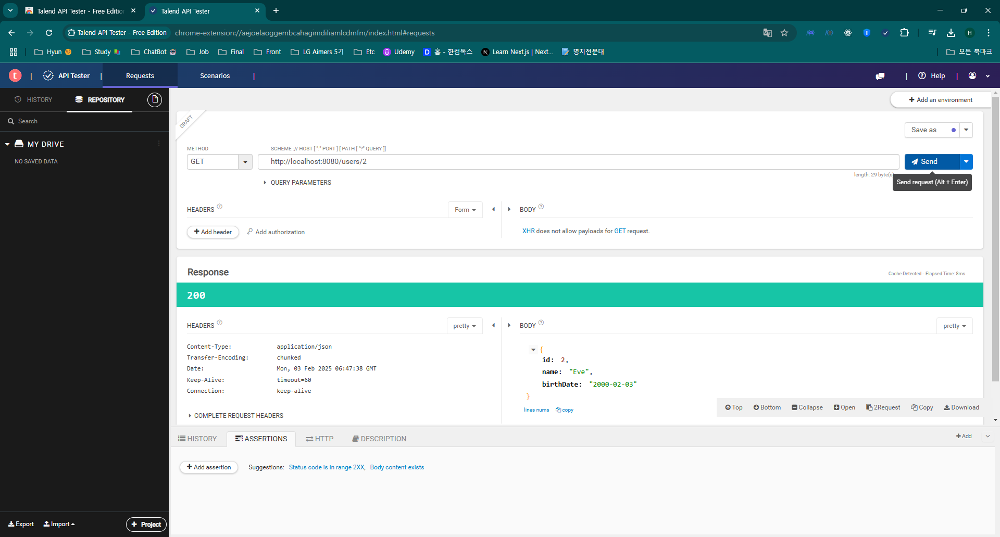

# 노트

## 0. Spring Boot로 REST API 생성하기 - 개요
#### Spring Boot로 REST API 만들기 - 목표
* 왜 스프링부트일까?
    * Spring boot 없이도 REST API를 생성할 수 있다.
    * 왜 스프링 부트를 사용할까 ?
* 어떻게 좋은 REST API를 만들 수 있을까 ?
    * REST API에 포함되어야 하는 리소스를 어떻게 알 수 있을까? (/users, /users/{id}/posts)
    * 작업을 식별하는 것은 어떻게 할 수 있을까? (GET, POST, PUT, DELETE, ...)
    * 요청과 응답 구조는 어떻게 정의할 수 있을까?
    * 적절한 응답 상태 (200, 404, 500, ...)
    * REST API의 우수사례
        * 늘 소비자 관점에서 바라봐야 한다
        * Validation, Internationalization - i18n, Exception Handling, HATEOAS, Versioning, Documentation, Content Negotiation, ...

#### Spring Boot로 REST API 만들기 - 접근법
* 1: 3개의 간단한 Hello World REST API를 만들기
    * Spring Boot를 이해
    * Spring Boot를 통한 REST API 빌드의 기본을 알아보기
        * @RestController, @RequestMapping, @PathVariable, JSON conversion
* 2: 소셜 미디어 애플리케이션 용 REST API 빌드 해보기
    * 좋은 REST API 설계
        * 리소스에 알맞는 URI (/users, /users/{id}, /users/{id}/posts)
        * 알맞은 요청 메서드 선택 (GET, POST, PUT, DELETE)
    * REST API 고급 기능을 사용해보기
        * Internationalization, HATEOAS, Versioning, Documentation, Content Negotiation, ... 
* 3: REST API를 데이터베이스에 연결하는 법
    * 가장 널리 쓰이는 방식은 JPA, Hibernate이다.
    * H2, MySQL Database 사용
        * H2는 인메모리 데이터베이스이다.

## 1. Spring Boot로 REST API 프로젝트 초기화하기
#### Spring initializr
* [Spring initializr](https://start.spring.io/)
* Dependencies
    * Spring Web
    * Spring Data JPA
    * H2 Database
    * Spring Boot DevTools

## 2. Spring Boot로 Hello World REST API 생성하기
* `HelloWorldController`
~~~java
@RestController
public class HelloWorldController {

    @RequestMapping(method = RequestMethod.GET, path = "/hello-world")
    public String helloWorld() {
        return "Hello World";
    }
}
~~~
* GET 요청으로 불러오며, path는 원하는 url 엔드포인트로 지정 (여기서는 `/hello-world`로 지정.)
* String인 Hello World를 리턴함

`HelloWorldController`
~~~java
@RestController
public class HelloWorldController {

    @GetMapping(path = "/hello-world")
    public String helloWorld() {
        return "Hello World";
    }
}
~~~
* 조금 더 직관적으로 보여주기 위해, RequestMapping 보다는 GetMapping을 사용.

## 3. Hello World REST API를 업그레이드하여 Bean 반환하기

`HelloWorldController`
~~~java
@RestController
public class HelloWorldController {
    // ... 생략
    @GetMapping(path = "/hello-world-bean")
    public HelloWorldBean helloWorldBean() {
        return new HelloWorldBean("Hello World");
    }
}
~~~

`HelloWorldBean`
~~~java
public class HelloWorldBean {
    private String message;

    public HelloWorldBean(String message) {
        this.message = message;
    }

    public String getMessage() {
        return message;
    }

    public void setMessage(String message) {
        this.message = message;
    }

    @Override
    public String toString() {
        return "HelloWorldBean{" +
                "message='" + message + '\'' +
                '}';
    }
}
~~~

* Controller에서 return이 단순 String이면, 문자열 그대로 반환
* return이 자바 객체이면 JSON으로 반환
    * 단, 자바 객체에 `생성자`, `Getter()`, `Setter()`, `toString()` 등의 메서드가 존재해야함

## 4. 백엔드에는 어떤 일이 벌어지고 있을까? Spring Boot 스타터와 자동 설정

`application.properties`
~~~
logging.level.org.springframwork=debug
~~~

* 백그라운드 단에서 동작하는 원리를 알아보기 위해 Debug logging 활성화
    * 로그는 주기적으로 바뀐다는 것을 유의

* 1: 요청은 어떻게 동작할까?
    * DispatcherServlet - Front Controller Pattern (Spring MVC 에서 모든 요청은 디스패처 서블릿이 처리한다)
        * Mapping servlets: dispatcherServlet urls=[/]
            * 디스패처 서블릿이 url을 확인하고, 알맞은 컨트롤러 메서드에 매핑
        * 디스패처 서블릿은 자동 설정에 의해 설정됨

* 2: 어떻게 `HelloWorldBean` 객체가 JSON으로 반환될까?
    * `@ResponseBody` + JacksonHttpMessageConverters
        * `@ResponseBody` : 응답을 HTTP 응답 본문으로 직접 전송
            * `@RestController` 내부에서 사용하고 있음.
        * JacksonHttpMessageConverters 자동 설정 (JSON 처리)

* 3: 에러 매핑은 어디서 설정할까?
    * 잘못된 url(엔드포인트)를 입력하면, Whitelabel 오류가 뜬다 (404)
    * 오류페이지 역시 자동 설정의 결과

* 4: 어떻게 모든 jar들을 사용할 수 있냐 (Spring, Spring MVC, Jackson, Tomcat)?
    * Starter Project 때문이다
    * Starter Projects - Spring Boot Starter Web (spring-webmvc, spring-web, spring-boot-starter-tomcat, spring-boot-starter-json)

## 5. 패스 변수로 Hello World REST API 업그레이드 하기
#### Path Parameters
* /users/{id}/todos/{id} => /users/2/todos/200
    * 이러한 변수들을 패스 매개변수라고 칭한다.

~~~java
@RestController
public class HelloWorldController {
    // ... 생략
    @GetMapping(path = "/hello-world/path-variable/{name}")
    public HelloWorldBean helloWorldPathVariable(@PathVariable String name) {
        return new HelloWorldBean(String.format("Hello World, %s", name));
    }
}
~~~

* path안에 `{}`를 넣어 변수를 지정, 메서드 파라미터에 `@PathVariable`을 지정하고 변수의 타입과 이름을 넣어준다.

## 6. SNS 애플리케이션용 REST API 설계하기
#### SNS 애애플리케이션용 REST API 설계
* Key Resources
    * Users
    * Posts
* Key Details
    * User : id, name, birthDate
    * Post : id, description

#### REST API 설계를 위한 요청 메서드
* GET - 특정 리소스에서 상세 정보를 검색
* POST - 새 리소스를 만들고자할 때 사용 
* PUT - 기존에 있는 리소스를 업데이트 할 때 사용
* PATCH - 기존 리소스의 일부만 업데이트 할 때 사용
* DELETE - 특정 리소스를 삭제

#### SNS 애플리케이션 용용 Resources & Methods
* Users REST API
    * 모든 사용자 검색
        * GET 요청 /users
    * 사용자 생성
        * POST 요청 /users
    * 특정 사용자 검색
        * GET 요청 /users/{id} -> /users/1
    * 특정 사용자 삭제
        * DELETE 요청 /users/{id} -> /users/1
    * 포스팅 REST API
        * 사용자가 포스팅한 글
            * GET 요청 /users/{id}/posts
        * 사용자가 포스팅을 만들 때
            * POST 요청 /users/{id}/posts
        * 특정 포스팅을 찾을 때 
            * GET 요청 /users/{id}/posts/{id}

## 7. 사용자 Bean과 UserDaoService 생성하기
* 사용자 정보를 담은 사용자 Bean을 만들어 보자
`User`
~~~java
public class User {
    private Integer id;
    private String name;
    private LocalDate birthDate;

    // 생성자, Getter(), Setter(), toString() 메서드
}
~~~
* 사용자 Bean을 중심으로 하는 REST API 만들기 
    * 사용자 상세정보를 저장, 검색, 특정 사용자 삭제 등 데이터베이스를 관리하고, 데이터베이스에 저장된 데이터를 가지고 작업을 하려면 DAO 객체를 만들어야한다.

`UserDaoService`
~~~java
@Component
public class UserDaoService {
    // JPA/Hibernate > Database

    private static List<User> users = new ArrayList<>();

    static {
        users.add(new User(1, "Adam", LocalDate.now().minusYears(30)));
        users.add(new User(2, "Eve", LocalDate.now().minusYears(25)));
        users.add(new User(3, "Jim", LocalDate.now().minusYears(20)));
    }

    public List<User> findAll() {
        return users;
    }

    public User findOne(int id) {
        Predicate<? super User> predicate =
                user -> user.getId().equals(id);
        return users.stream().filter(predicate).findFirst().get();
    }
}
~~~

## 8. User Resource에서 GET 메서드 구현하기
~~~java
@RestController
public class UserResource {

    private UserDaoService userDaoService;

    // @Autowired 생략
    public UserResource(UserDaoService userDaoService) {
        this.userDaoService = userDaoService;
    }

    @GetMapping("/users")
    public List<User> retrieveAllUsers() {
        return userDaoService.findAll();
    }

    @GetMapping("/users/{id}")
    public User retrieveUsers(@PathVariable int id) {
        return userDaoService.findOne(id);
    }

}
~~~
* 생성자 주입 `UserResource` (생성자가 하나면 `@Autowired` 생략 가능)
* /users 엔드포인트 접근시, 모든 사용자
* /users/{id} 엔드포인트 접근시 (e.g. /users/1), 아이디에 해당하는 사용자

## 9. User Resource에서 POST 메서드 구현하기
`UserResource`
~~~java
@RestController
public class UserResource {

    // ... 생략
    @PostMapping("/users")
    public void createUser(@RequestBody User user) {
        userDaoService.save(user);
    }
}
~~~

`UserDaoService`
~~~java
@Component
public class UserDaoService {
    // JPA/Hibernate > Database

    private static List<User> users = new ArrayList<>();

    static {
        users.add(new User(1, "Adam", LocalDate.now().minusYears(30)));
        users.add(new User(2, "Eve", LocalDate.now().minusYears(25)));
        users.add(new User(3, "Jim", LocalDate.now().minusYears(20)));
    }
    // ... 생략
    public User save(User user) {
        user.setId(++usersCount);
        users.add(user);
        return user;
    }
}
~~~
* [Talend API Tester](https://chromewebstore.google.com/detail/talend-api-tester-free-ed/aejoelaoggembcahagimdiliamlcdmfm)
* 아쉽게도 GET과 달리, 브라우저에서는 POST 요청을 바로 보낼 순 없다.
    * POST로 요청을 보내려면, REST API 클라이언트가 필요하다.

* Method 지정, URL, BODY를 입력해서 요청을 보냈다
    * ID는 동적으로 받기 때문에 넣지 않음.

## 10. POST 메소드를 개선해 올바른 HTTP 상태 코드와 Location
#### REST API의 다양한 응답 형태
* 200 (OK) : 성공
* 201 (Created) : POSt 요청으로 새 리소스를 생성했을 때 
* 204 (No Content) : 성공, 응답으로 반환할 본문 없음
    * PUT, DELETE후 정상적으로 데이터베이스 반영이 되었음을 알리는 용도
* 400 (Bad Request) : 정보 전달 시, 해당 정보가 검증을 통과 못한 경우 (검증 에러 등)
* 401 (Unauthorized) : 요청에 올바른 정보를 제공하지 않을 때 (인증 실패)
* 404 (Not Found) : 요청 리소스가 존재하지 않는 경우
* 500 (Server Exception) : 서버에서 예외가 발생한 상황

#### User POST API에 201 요청 실습
`UserResource`
~~~java
@RestController
public class UserResource {

    // ... 생략
    @PostMapping("/users")
    public ResponseEntity<User> createUser(@RequestBody User user) {
        userDaoService.save(user);

        return ResponseEntity.created(null).build();
    }
}
~~~
* 기존의 void 반환 타입에서 ResponseEntity를 반환하고, Object는 User를 반환한다.

#### Location
`UserResource`
~~~java
@RestController
public class UserResource {

    @PostMapping("/users")
    public ResponseEntity<User> createUser(@RequestBody User user) {
        User savedUser = userDaoService.save(user);

        URI location = ServletUriComponentsBuilder.fromCurrentRequest()
                .path("/{id}")
                .buildAndExpand(savedUser.getId())
                .toUri();
        
        return ResponseEntity.created(location).build();
    }
}
~~~
* 기존의 null이었던 `create()` 메서드를 location으로 채웠다.
    * `ServletUriComponentsBuilder.fromCurrentRequest()` : HTTP 요청 정보를 기반으로 URI 빌더 생성
    * `path("/{id}")` : 생성된 리소스의 URI 경로, id 추가
* 이를 통해, POST API 요청으로 생성된 `USer`의 id가 포함된 url이 리턴된다
    * http://localhost:8080/users/4
    * 해당 로케이션 url을 GET 메서드로 요청, 생성된 유저 확인 가능

## 11. 예외 처리 구현하기 - 404 Resource Not found
* 만약 존재하지 않는 사용자를 조회할 시 500 에러가 발생한다.
    * localhost:8080/users/101
    * 이를 404 (Not Found)로 변경이 필요하다.

#### `findOne()` 수정
~~~java
@Component
public class UserDaoService {
    public User findOne(int id) {
        Predicate<? super User> predicate =
                user -> user.getId().equals(id);
        return users.stream().filter(predicate).findFirst().orElse(null);
    }
}
~~~
* return 문에 null을 넣어서 존재하지 않는 페이지로 접근하면 아무것도 뜨지 않는다.

#### `UserResource::retrieveUsers`
~~~java
@RestController
public class UserResource {
    // ... 생략
    @GetMapping("/users/{id}")
    public User retrieveUsers(@PathVariable int id) {
        User user = userDaoService.findOne(id);

        if (user == null)
            throw new UserNotFoundException("id:" + id);
        return user;
    }
    // ... 생략
}
~~~
* `userDaoService::findOne()` 메서드의 결과가 null로 리턴 시, 예외 처리 

#### `UserNotFoundException` 
~~~java
@ResponseStatus(code = HttpStatus.NOT_FOUND)
public class UserNotFoundException extends RuntimeException {

    public UserNotFoundException(String s) {
        super(s);
    }
}
~~~
* 커스텀 예외 클래스를 만든다.
* `@ResponseStatus`로 HTTP 코드 지정 가능
* 생성자를 통해, 외부에서 주입 

## 12. 모든 리소스를 대상으로 예외 처리 구현하기
#### `ErrorDetails`
~~~java
public class ErrorDetails {
    private LocalDateTime timestamp;
    private String message;
    private String details;

    // 생성자, Getter(), Setter()
}
~~~

#### `ResponseEntityExceptionHandler`
~~~
{
    "timestamp": "2024-06-30T10:39:01.153+00:00",
    "status": 404,
    "error": "Not Found",
    "message": "id:4",
    "path": "/users/4"
}
~~~
* 예외 발생 시, 기본적인 Handler 양식

#### `ResponseEntityExceptionHandler`를 상속하여 커스텀 예외 핸들러 만들기
~~~java
@ControllerAdvice
public class CustomizedResponseEntityExceptionHandler extends ResponseEntityExceptionHandler {
    @ExceptionHandler(Exception.class)
    public final ResponseEntity<ErrorDetails> handleAllException(Exception ex, WebRequest request) {
        ErrorDetails errorDetails = new ErrorDetails(request.getDescription(false),
                ex.getMessage(), LocalDateTime.now());
        return new ResponseEntity<ErrorDetails>(errorDetails, HttpStatus.INTERNAL_SERVER_ERROR);
    }
}
~~~

#### 특정 예외 클래스에 대한 예외처리
~~~java
@ControllerAdvice
public class CustomizedResponseEntityExceptionHandler extends ResponseEntityExceptionHandler {
    @ExceptionHandler(UserNotFoundException.class)
    public final ResponseEntity<ErrorDetails> handleUserNotFoundException(Exception ex, WebRequest request) {
        ErrorDetails errorDetails = new ErrorDetails(request.getDescription(false),
                ex.getMessage(), LocalDateTime.now());
        return new ResponseEntity<ErrorDetails>(errorDetails, HttpStatus.NOT_FOUND);
    }
}
~~~
* `@ControllerAdvice` : 애플리케이션 전체에서 발생하는 예외 처리 클래스에게 부여
    * 일반적으로 `ResponseEntityExceptionHandler` 클래스 확장하여 사용, 필수적이진 않다 

## 13. DELETE 메소드로 사용자 리소스 삭제하기
#### User 삭제 메서드 추가
~~~java
@Component
public class UserDaoService {
    // ... 생략
    public void deleteById(int id){
        Predicate<? super User> predicate =
                user -> user.getId().equals(id);
        users.removeIf(predicate);
    }
}
~~~

#### User 삭제 API 추가
~~~java
@RestController
public class UserResource {
    // ... 생략
    @DeleteMapping("/users/{id}")
    public void deleteUser(@PathVariable int id) {
        userDaoService.deleteById(id);
    }
}
~~~

## 14. REST API에서 유효성 검증하기
* POST로 신규 User 생성 시, 필드가 빈 값이거나, 출생일이 미래시점으로 되어있는 경우에도 생성이 가능하다 유효성 검증 기능을 추가할 것

* `pom.xml`에 의존성 추가
~~~xml
<dependency>
    <groupId>org.springframework.boot</groupId>
    <artifactId>spring-boot-starter-validation</artifactId>
</dependency>
~~~

* `UserResource` 클래스내의 메서드에 `@Valid` 어노테이션 추가
~~~java
@RestController
public class UserResource {
    // ... 생략
    @PostMapping("/users")
    public ResponseEntity<User> createUser(@Valid @RequestBody User user) {
        User savedUser = userDaoService.save(user);

        URI location = ServletUriComponentsBuilder.fromCurrentRequest()
                .path("/{id}")
                .buildAndExpand(savedUser.getId())
                .toUri();

        return ResponseEntity.created(location).build();
    }
    // ... 생략
}
~~~

* `User` 클래스에 조건을 추가
~~~java
public class User {
    private Integer id;

    @Size(min=2, message = "이름은 2글자 이상이어야 합니다.")
    private String name;

    @Past(message = "생일은 과거 시점이어야 합니다.")
    private LocalDate birthDate;

    // 생성자, Getter(), Setter() 메서드
}
~~~
* `@Size` : 최소 입력 문자 지정
* `@Past` : 무조건 과거 시점이어야 한다 (생일이 미래시 일 순 없기 때문)
* 에러시, 메시지를 띄울 수 있다.

* `CustomizedResponseEntityExceptionHandler`
~~~java
@ControllerAdvice
public class CustomizedResponseEntityExceptionHandler extends ResponseEntityExceptionHandler {
    // ... 생략
    @Override
    protected ResponseEntity<Object> handleMethodArgumentNotValid(MethodArgumentNotValidException ex, HttpHeaders headers, HttpStatusCode status, WebRequest request) {
        ErrorDetails errorDetails = new ErrorDetails(request.getDescription(false),
                "Total Errors Count: " + ex.getErrorCount() + ", Default Error: " + ex.getFieldError().getDefaultMessage(),
                LocalDateTime.now());

        return new ResponseEntity<>(errorDetails, HttpStatus.BAD_REQUEST);
    }
}
~~~
* 400 에러에 대해 `handleMethodArgumentNotValid` 메서드 재정의
* `ex.getMessage()`가 너무 많은 내용을 담고 있어 커스텀 메시지 리턴
    * `ex.getErrorCount()` : 발생 오류 갯수
    * `ex.getDefaultMessage()` : 첫번째 오류 메시지

## 15. 고급 REST API 기능의 개요
* REST API에 대한 문서
* 콘텐츠 협상 (Content Negotiation)
* 국제화 (Internationalization) - i18n
* 여러 버전의 REST API 생성하는 방법
* HATEOAS
* Static Filtering
* Dynamic Filtering
* Monitoring
* ...

## 16. Open API 사양 및 Swagger 파악하기
#### REST API
* REST API 사용자들은 REST API에 대해 잘 이해하고 있어야 한다.
    * Resources
    * Actions
    * Request / Response Structure (Constraints/Validations)
* 문제
    * 정확성 : 어떤 문서가 최신이고, 정확한지 알 수 있을까 ?
    * 일관성 : 모든 API의 문서가 일관된 형식으로 이루어져 있는지 확신할 수 있을까 ?
* 옵션
    * 1. 문서를 수동으로 관리하는 것
        * 문서를 수동으로 관리하는 경우, 코드와 동기화하는지 확인하기 위해 노력해야함.
    * 2. 코드에서 문서를 생성하는 방법 

#### Swagger Quick Overview
* 2011. Swagger Specification, Swagger Tools가 도입
* 2016. Open API Specification 만들어짐 (based on Swagger Specification)
    * Swagger Tools는 아직 존재한다. (e.g. Swagger UI)
* Open API Spcification: REST API를 정의하기 위한, 특정 언어에 국한되지 않는 표준 인터페이스
* Swagger UI : REST API를 좀 더 시각적으로 보기 쉽도록 제공하는 툴

## 17. Swagger 문서의 자동 생성 구성하기
#### * `pom.xml` 의존성 추가 [spring-doc](https://springdoc.org/#Introduction)
~~~xml
<dependency>
    <groupId>org.springdoc</groupId>
    <artifactId>springdoc-openapi-starter-webmvc-ui</artifactId>
    <version>2.8.4</version>
</dependency>
~~~
#### API 문서 확인
* `/swagger.ui.html` 엔드포인트로 접근, 자동 생성된 API 문서 확인 가능

#### Open API 사양 확인
* `/v3/api-docs` 엔드포인트로 이동하면, Open API 사양을 확인할 수 있다.

* info: 일반적인 정보가 담겨있다, API 제목, 버전 등
* servers: API의 노출 위치에 관한 정보
* paths: 노출된 모든 리소스에 관한 세부 정보
* components: 정의된 스키마에 대한 정보

## 18. 콘텐츠 협상 알아보기 - XML 지원 구현하기
#### 콘텐츠 협상
* 클라이언트와 서버가 주고받을 데이터의 형식을 결정하는 과정
* JSON 형식으로 사용자 세부 사항을 얻고자 할 수 있으나, 일부는 XML 형식의 응답을 기대할 수 있다.
* Accept 헤더 사용.
* 동일한 리소스에 대해 여러 표현 방식을 보유하는 것이 가능하다.
    * e.g. 콘텐츠 형식 - XML or JSON or ...
    * e.g. 다른 언어 - 영어 or 한국어 or ...

#### `pom.xml` 의존성 추가
~~~xml
<dependency>
    <groupId>com.fasterxml.jackson.dataformat</groupId>
    <artifactId>jackson-dataformat-xml</artifactId>
</dependency>
~~~

#### Talend API Tester 확인하기

* 요청할 URL를 입력 후, HEADERS > Accept에 원하는 형식을 입력
    * `application/xml` 을 입력하여 xml 형식로 받는다.
* XML 표현과 Swagger 문서는 다른 고급 기능을 다룰 때, 몇 가지 문제를 일으킬 수 있으므로 의존성 주석처리 진행

## 19. REST API의 국제화 알아보기
#### Internationalization - i18n
* 다른 언어를 사용하는 사용자에게 어떻게 전달할 수 있을까 ?
    * Internationalization - i18n (영어로 국제화는 18개의 글자로 이루어져있기에 i18n으로 간략화해서 쓰기도 한다.)
    * 보통 HTTP Request Header를 사용, Accept-Language 라는 헤더를 전송한다.
    * e.g. en - English

* `src/main/resources` 해당 경로에 `messages.properties` 파일 생성
* `application.properties` 와 같은 폴더 루트
~~~
good.morning.message=Good Morning
~~~

* `HelloWorldController`
~~~java
@RestController
public class HelloWorldController {
    private MessageSource messageSource;

    public HelloWorldController(MessageSource messageSource) {
        this.messageSource = messageSource;
    }
    // ... 생략
    @GetMapping(path = "/hello-world-internationalized")
    public String helloWorldInternationalized() {

        Locale locale = LocaleContextHolder.getLocale();
        return messageSource.getMessage("good.morning.message", null, "Default Message", locale);
    }
}
~~~
* `LocaleContextHolder.getLocale()` : `Accept-Language` 헤더 값을 인지, 값이 존재하지 않을 시, 로컬 시스템 기본 값으로 지정된다

## 20. REST API 버전 관리 - URI 버전 관리
* 응답의 구조를 임의로 변경한다면, 모든 소비자에게 영향을 주게 된다.
* Versioning REST API (API에 대한 버전 관리 구현 )
    * URL (v1/person or v2/person)
    * Request Parameter (version=v1 or v2)
    * Header
    * Media Type

#### URL 버전 관리 (twitter)

`VersioningPersonController`
~~~java
@RestController
public class VersioningPersonController {

    @GetMapping("/v1/person")
    public PersonV1 getFirstVersionOfPerson() {
        return new PersonV1("Bob Charlie");
    }

    @GetMapping("/v2/person")
    public PersonV2 getSecondVersionOfPerson() {
        return new PersonV2(new Name("Bob", "Charlie"));
    }
}
~~~

`PersonV1`, `PersonV2` 클래스
~~~java
public class PersonV1 {
    private String name;
    public PersonV1(String name) {
        this.name = name;
    }
    public String getName() {
        return name;
    }
    public void setName(String name) {
        this.name = name;
    }
    @Override
    public String toString() {
        return "PersonV1{" +
                "name='" + name + '\'' +
                '}';
    }
}
~~~

`Name` 클래스
~~~java
public class Name {
    private String firstName;
    private String lastName;

    public Name(String firstName, String lastName) {
        this.firstName = firstName;
        this.lastName = lastName;
    }

    public String getFirstName() {
        return firstName;
    }

    public void setFirstName(String firstName) {
        this.firstName = firstName;
    }

    public String getLastName() {
        return lastName;
    }

    public void setLastName(String lastName) {
        this.lastName = lastName;
    }

    @Override
    public String toString() {
        return "Name{" +
                "firstName='" + firstName + '\'' +
                ", lastName='" + lastName + '\'' +
                '}';
    }
}
~~~

* V1, V2 클래스는 같지만 V2 같은 경우, Name 클래스를 이용하여 성과 이름을 분리해서 표현

* `/v1/person` 엔드포인트
~~~json
{
    "name": "Bob Charlie"
}
~~~

* `/v2/person` 엔드포인트
~~~json
{
    "name": {
        "firstName": "Bob",
        "lastName": "Charlie"
    }
}
~~~

## 21. REST API 버전 관리 - 요청 매개변수, 헤더, 콘텐츠 협상

#### 요청 매개변수 (Request Parameter) (Amazon)

`VersioningPersonController`
~~~java
@RestController
public class VersioningPersonController {

    @GetMapping(path = "/person", params = "version=1")
    public PersonV1 getFirstVersionOfPersonRequestParameter() {
        return new PersonV1("Bob Charlie");
    }

    @GetMapping(path = "/person", params = "version=2")
    public PersonV2 getSecondVersionOfPersonRequestParameter() {
        return new PersonV2(new Name("Bob", "Charlie"));
    }
}
~~~
* 같은 엔드포인트이지만, 파라미터로 버전관리를 한다
    * http://localhost:8080/person?version=1
    * http://localhost:8080/person?version=2

#### 커스텀 헤더 (Custom Header) (Microsoft)

`VersioningPersonController`
~~~java
@RestController
public class VersioningPersonController {

    @GetMapping(path = "/person/header", headers = "X-API-VERSION=1")
    public PersonV1 getFirstVersionOfPersonRequestHeader() {
        return new PersonV1("Bob Charlie");
    }

    @GetMapping(path = "/person/header", headers = "X-API-VERSION=2")
    public PersonV2 getSecondVersionOfPersonRequestHeader() {
        return new PersonV2(new Name("Bob", "Charlie"));
    }
}
~~~
* Talend API Tester로 확인
    * Headers 옵션에 X-API-VERSION : (원하는 버전 숫자)를 입력

#### 미디어 타입 (Github)
`VersioningPersonController`
~~~java
@RestController
public class VersioningPersonController {

    @GetMapping(path = "/person/accept", produces = "application/vnd.company.app-v1+json")
    public PersonV1 getFirstVersionOfPersonAcceptHeader() {
        return new PersonV1("Bob Charlie");

    }

    @GetMapping(path = "/person/accept", produces = "application/vnd.company.app-v2+json")
    public PersonV2 getSecondVersionOfPersonAcceptHeader() {
        return new PersonV2(new Name("Bob", "Charlie"));
    }
}
~~~

#### 추천하는 방식?
* 고려해야할 요인
    * URI 및 요청 매개변수 버전 관리 방법의 경우, URI Pollution이 많이 발생한다.
        * 그에 반해 헤더 버전 관리와 미디어 유형 버전 관리에서는 동일한 URL 사용
    * HTTP 헤더의 오용
        * HTTP 헤더는 버전관리 용도로 사용해서는 안된다.
        * 즉, 헤더와 미디어 유형 버전 관리는 헤더를 오용하고 있는 것!
    * 캐싱
        * 일반적으로 URL을 기반으로 수행, 헤더 및 미디어 버전 관리의 경우 동일한 URL 공유
            * 헤더 및 미디어 버전 관리일 경우, URL 기반으로 캐싱을 할 수 없기 때문에 캐싱 수행 전 헤더를 살펴봐야 한다.
    * 브라우저에서 요청을 실행할 수 있는지?
        * URI 및 요청 매개변수 버전 관리는 브라우저에서 간편하게 실행할 수 있다.
        * 헤더 및 미디어 버전 관리에서는 차이가 헤더에 있다.
    * API 문서
        * URI 및 요청 매개변수 버전 관리는 URL이 다르기 때문에 문서화하기 편하다.
        * API 문서 생성 툴은 보통 헤더를 기준으로 구분하는 문서의 생성을 지원하지 않을 수 있음.
* 버전 관리가 필요하기 전에도 버전 관리에 대해서 고려해보는 것이 좋다.
    * REST API를 구축하기 시작할 때 버전 관리에 대해 생각해야 한다.
    * 일관된 버전 관리 방식을 사용해야 한다.

## 22. REST API HATEOAS 구현하기
#### HATEOAS
* 애플리케이션의 상태를 나타내는 엔진 
* 우리는 웹사이트를 방문할 때 데이터를 확인하고 작업을 수행한다.
* REST API를 향상시켜 사용자에게 후속 작업을 수행하는 방법을 알려주는 것?
* 구현 옵션
    * 1. 사용자 정의 형식을 설계, 사용자 정의 구현을 생성하는 것.
        * 유지하기 까다로움
    * 2. 표준 구현
        * HAL
        * Spring HATEOAS

#### Spring HATEOAS 사용하기
~~~xml
<dependency>
    <groupId>org.springframework.boot</groupId>
    <artifactId>spring-boot-starter-hateoas</artifactId>
</dependency>
~~~

~~~java
@RestController
public class UserResource {
    // ... 생략
    @GetMapping("/users")
    public List<User> retrieveAllUsers() {
        return userDaoService.findAll();
    }

    @GetMapping("/users/{id}")
    public EntityModel<User> retrieveUser(@PathVariable int id) {
        User user = userDaoService.findOne(id);

        if (user == null)
            throw new UserNotFoundException("id:" + id);

        EntityModel<User> entityModel = EntityModel.of(user);

        WebMvcLinkBuilder link = linkTo(methodOn(this.getClass()).retrieveAllUsers());
        entityModel.add(link.withRel("all-users"));

        return entityModel;
    }
}
~~~
* `EntityModel`: Spring HATEOAS에서 제공하는 클래스, 데이터와 링크 정보를 함께 감싸는 역할
    * 단순히 User 객체만 반환하는 게 아니라, 이 데이터와 관련된 추가 정보를(링크) 포함할 수 있도록 해준다.
* `linkTo()`: 특정 컨트롤러 메서드에 대한 링크를 생성
    * `methodOn(this.getClass()).retrieveAllUsers()`: 현재 클래스의 retrieveAllUsers() 메서드를 호출하는 링크를 지정
* `entityModel.add()`: 링크를 추가하는 작업
    * `withRel("all-users")`: "all-users"라는 이름을 명시.

## 23. REST API 정적 필터링 구성하기
#### REST API 응답의 커스터마이징
* Serialization: 객체를 스트림으로 전환하는 프로세스
    * 가장 많이 쓰이는 자바의 Json 직렬화 프레임워크는 Jackson이다.
* Jackson 프레임워크가 반환하는 REST API 응답을 커스터마이징하는 방법.

#### 응답의 필드 이름 커스터마이징
* `JSONProperty`

`User`
~~~java
public class User {
    private Integer id;

    @Size(min=2, message = "이름은 2글자 이상이어야 합니다.")
    @JsonProperty("user_name")
    private String name;

    @Past(message = "생일은 과거 시점이어야 합니다.")
    @JsonProperty("birth_date")
    private LocalDate birthDate;
}
~~~
* `JsonProperty`를 원하는 필드 위에 어노테이션, 원하는 이름을 지정하면 이름이 변경된다.

#### 선택된 필드만 반환하기
* 필터링
    * e.g. Bean에 정의된 비밀번호가 있는데, 응답에는 비밀번호를 전송하고 싶지 않는 경우
        * 정적 필터링 (여러 REST API에서 Bean에 적용된 동일한 필터링)
            * @JsonIgnoreProperties, @JsonIgnore
        * 동적 필터링 (특정한 REST API에 전송할 때만 Bean에서 필터링)
            * @JsonFilter with FilterProvider

`FilteringController`
~~~java
@RestController
public class FilteringController {

    @GetMapping("/filtering")
    public SomeBean filtering() {
        return new SomeBean("value1", "value2", "value3");
    }

    @GetMapping("/filtering-list")
    public List<SomeBean> filteringList() {
        return Arrays.asList(new SomeBean("value1", "value2", "value3"),
                new SomeBean("value4", "value5", "value6"));
    }
}
~~~

`SomeBean`
~~~java
// @JsonIgnoreProperties({"field1", "field2"})
public class SomeBean {
    private String field1;
    @JsonIgnore
    private String field2;
    private String field3;

    // 생성자, Getter(), Setter(), toString() 메서드
}
~~~

* `@JsonIgnore`로 특정한 필드를 응답에서 제외할 수 있다.
    * 정적 필터링이기 때문에 유연성이 떨어지는 단점이 존재
* `@JsonIgnoreProperties`로 클래스 수준에서 특정 필드를 응답에서 제외할 수 있다.
    * Property가 2개 이상이면, `{}`로 감쌀수 있다.
* `@JsonIgnore`은 필드 수준에서 응답을 제외시키기 때문에, 필드 이름에 대한 제약이 없다
    * `@JsonIgnoreProperties`는 필드 이름이 변경될 시, 이름을 바꿔줘야한다.

## 24. REST API 동적 필터링 구현하기