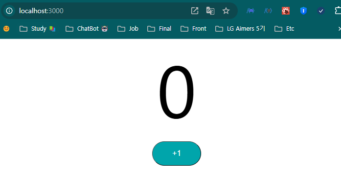

# 노트

## 1. 카운터 예제를 통해 React 컴포넌트 살펴보기
* 컴포넌트에 대해서 알아보기
    * View (JSX or Javascript)
    * Logic (JavaScript)
    * Styling (CSS)
    * State (내부 데이터 저장)
    * Props (데이터 전달)
* 카운터 예제를 통해 하나씩 구현

## 2. React 애플리케이션 시작하기 - Counter
```javascript
export default function Counter() {
    
    function incrementCounterFunction() {
        console.log('increment clicked')
    }
    
    return (
        <div className="Counter">
            <span className="count">0</span>
            <button className="counterButton" onClick={incrementCounterFunction}>increment</button>
        </div>
    )
}
```
* `onClick` 리스너로 function을 지정한다. 단, `incrementCounterFunction()`로 하기 되면 결과값만 호출되고 버튼을 클릭해도 아무런 반응이 없다
* `incrementCounterFunction` 이렇게 넣어야  버튼을 클릭했을 때 console 값에서 제대로 된 값을 확인할 수 있다.

## 3. React 애플리케이션 시작하기 - Counter-2
```javascript
export default function Counter() {

    const buttonStyle = {
        fontSize:"16px",
        backgroundColor:"#00a5ab",
        width:"100px",
        margin:"10px",
        color: "white",
        padding: "15px",
        borderRadius: "30px"
    }
    
    function incrementCounterFunction() {
        console.log('increment clicked')
    }
    
    return (
        <div className="Counter">
            <span className="count">0</span>
            <div>
                <button className="counterButton" 
                        onClick={incrementCounterFunction}
                        style={buttonStyle}
                
                >+1</button>
            </div>
        </div>
    )
}
```
* 이렇게 buttonStyle을 변수로 지정해 style에 넣을 순 있으나, CSS 파일을 만드는 방법을 권장한다.

`Counter.jsx`
```jsx
import './Counter.css'

export default function Counter() {
    
    function incrementCounterFunction() {
        console.log('increment clicked')
    }
    
    return (
        <div className="Counter">
            <span className="count">0</span>
            <div>
                <button className="counterButton" 
                        onClick={incrementCounterFunction}
                >+1</button>
            </div>
        </div>
    )
}
```

`Counter.css`
```css
.counterButton {
    font-size:16px;
    background-color: #00a5ab;
    width: 100px;
    margin: 10px;
    color: white;
    padding: 15px;
    border-radius: 30px;
    border-color: black;
    border-width: 1px;
}

.count {
    font-size: 150px;
    padding: 20px;
}
```


## 4. useState 훅을 사용해 React State 알아보기 - Counter에 상태 추가

#### State in React
* State는 리액트의 내장 객체로서, 컴포넌트의 데이터 또는 정보를 저장하는데 사용
* React 16.8 버전 부터 Hooks가 나오면서, 사용이 매우 쉬워짐.
    * `useState` 를 활용해서 함수형 컴포넌트에도 `State`를 추가할 수 있다.
    * `useState`는 2개를 반환한다
        * State의 현재 상태
        * State를 업데이트하는 함수
    * 각각의 컴포넌트의 인스턴스들은 각각 State를 갖는다.
    * 어떻게 컴포넌트간의 State를 공유할 수 있을까?
        * 부모 컴포넌트

```javascript
import { useState } from 'react'
import './Counter.css'

export default function Counter() {
    
    const [count, setCount] = useState(0);

    function incrementCounterFunction() {
        setCount(count + 1)
    }
    
    return (
        <div className="Counter">
            <span className="count">{count}</span>
            <div>
                <button className="counterButton" 
                        onClick={incrementCounterFunction}
                >+1</button>
            </div>
        </div>
    )
}
```
* `useState`는 2개의 값으로 매핑된다 하나는 현재 값, 하나는 현재 값을 바꿀수 있는 지정 함수
    * `const [count, setCount] = useState(0);` 으로 초기값을 설정한다
    * `function`과 `onClick`을 사용하여 누를때 마다 카운트가 올라가는 것을 볼 수 있다.

## 5. React State 알아보기 - 백그라운드에서는 무슨 일이 일어날까?
* 상태를 업데이트 => 리액트는 view를 업데이트
* 이전에는 HTML 페이지를 업데이트하기 위해 DOM을 직접 업데이트.
* 리액트는 다른 방식으로 동작
    * 리액트는 Virtual DOM을 사용
    * 리액트는 HTML 전체를 가상으로 만들어 메모리에 보관
        * 가상 DOM을 업데이트하는 코드를 작성
    * 리액트가 구분하는 법
        * 리액트는 가상 DOM v1을 페이지 로드할 때 생성한다.
        * 액션을 취한다
            * 상태가 업데이트 되면 리액트는 해당 컴포넌트를 다시 렌더링하고 두 번째 버전의 가상 DOM을 생성
            * 가상DOM v1과 v2의 차이점을 비교한다
            * 컴포넌트의 상태가 조금이라도 변경되면 리액트는 가상 DOM부터 업데이트한다.
* 우리가 직접 DOM을 업데이트하는 것이 아니라, React가 DOM의 변경사항을 확인하여 업데이트 한다
    * 효율적

## 6. React Props 알아보기 - 카운터 증분 값 설정하기
* 하나의 컴포넌트는 여러 개의 프로퍼티를 가실 수 있다. 이 props를 다른 컴포넌트에게 전달할 수 있다.
`App.js`
```javascript
import './App.css';
import Counter from './components/counter/Counter';
// PlayingWithProps로 각각의 프로퍼티를 전달
function App() {
    return (
        <div className="App">
            <PlayingWithProps property1="value1" property2="value2" />
            <Counter />
        </div>
    );
}
// property1, property2를 {}안에 넣어서 전달
function PlayingWithProps({property1, property2}) {
    console.log(property1)
    console.log(property2)
    return (
        <div>Props</div>
    )
}
export default App;
```
* 매개변수를 이용하여 컴포넌트에게 값을 전달할 수 있다.

#### 카운터에 적용시켜보기

`App.js`
```javascript
import './App.css';
import Counter from './components/counter/Counter';

function App() {
  return (
    <div className="App">
      <Counter by="1"/>
      <Counter by="2"/>
      <Counter by="5"/>
    </div>
  );
}
export default App;
```

`Counter.jsx`
```javascript
import { useState } from 'react'
import './Counter.css'

export default function Counter({by}) {
    
    const [count, setCount] = useState(0);

    function incrementCounterFunction() {
        setCount(count + by)
    }

    function decrementCounterFunction() {
        setCount(count - by)
    }
    
    return (
        <div className="Counter">
            <span className="count">{count}</span>
            <div>
                <button className="counterButton" 
                        onClick={incrementCounterFunction}
                >+{by}</button>
                <button className="counterButton" 
                        onClick={decrementCounterFunction}
                >-{by}</button>
            </div>
        </div>
    )
}
```
* 하지만 `"1"` 문자형으로 전달되서 그런지 덧셈 및 뺄셈 연산으로 동작하지 않는다 왜 이럴까 ?

## 7. 여러 개의 카운터 버튼 추가하기
#### 이전 단계에서 진행했던 매개변수 오류를 수정해보자

`Counter.jsx`
```javascript
import './App.css';
import Counter from './components/counter/Counter';

function App() {
  return (
    <div className="App">
      <Counter by={1}/>
      <Counter by={2}/>
      <Counter by={5}/>
    </div>
  );
}
export default App;
```
* `{}`를 사용해서 정수형을 넣으니 제대로 작동한다.

#### 매개변수 타입 지정(제한)하기, 기본 값 설정하기
`Counter.jsx`
```javascript
// ... 생략
import PropTypes from 'prop-types'; // PropTypes 임포트
// ... 생략
Counter.propTypes = {
    by: PropTypes.number.isRequired, // by는 숫자이며 필수 props
  };

  
Counter.defaultProps = {
    by: 1,
  };
```
* `propTypes`로 매개변수의 타입을 지정할 수 있다 (다른 타입이 들어오면 오류 발생)
    * `by` prop이 숫자 (`number`)이며 필수이다.
* `defaultProps`로 매개변수의 기본 값을 지정할 수 있다.

## 8. React State 끌어올리기 - Counter 및 CounterButton 구성
#### State를 전역으로 올린다.

`Counter.jsx`
```javascript
import './App.css';
import Counter from './components/counter/Counter';

function App() {
  return (
    <div className="App">
      <Counter />
    </div>
  );
}
export default App;
```
`Counter.jsx`
```javascript
// ... 생략
export default function Counter() {

    const [count, setCount] = useState(0);

    function incrementCounterFunction(by) {
        setCount(count+by)
    }

    return (
        <>
            <span className='totalCount'>{count}</span>
            <CounterButton by={1}/>
            <CounterButton by={2}/>
            <CounterButton by={5}/>
        </>
    )
}
// ... 생략
```

## 9. React State 끌어올리기 - 상위 컴포넌트 메서드 호출하기

`Counter.jsx`
```javascript
import { useState } from 'react'
import PropTypes from 'prop-types';
import './Counter.css'
// Counter를 전체 카운터로 끌어올린다.
// 상위 컴포넌트에서 useState 초기값, 증가 함수, count 변수까지 지정
// CounterButton 컴포넌트로 메서드, by 값 등의 파라미터를 보낸다
export default function Counter() {

    const [count, setCount] = useState(0);

    function incrementCounterFunction(by) {
        setCount(count+by)
    }

    function decrementCounterFunction(by) {
        setCount(count-by)
    }


    return (
        <>
            <span className='totalCount'>{count}</span>
            <CounterButton by={1} incrementCounterMethod={incrementCounterFunction} decrementCounterMethod={decrementCounterFunction}/>
            <CounterButton by={2} incrementCounterMethod={incrementCounterFunction} decrementCounterMethod={decrementCounterFunction}/>
            <CounterButton by={5} incrementCounterMethod={incrementCounterFunction} decrementCounterMethod={decrementCounterFunction}/>
        </>
    )
}

// props를 받고, 이를 function으로 정의, onClick 리스너로 증가 및 감소를 시킨다.
function CounterButton({by, incrementCounterMethod, decrementCounterMethod}) {
    
    const [count, setCount] = useState(0);

    function incrementCounterFunction() {
        setCount(count + by)
        incrementCounterMethod(by)
    }

    function decrementCounterFunction() {
        setCount(count - by)
        decrementCounterMethod(by)
    }
    
    return (
        <div className="Counter">
            <div>
                <button className="counterButton" 
                        onClick={incrementCounterFunction}
                >+{by}</button>
                <button className="counterButton" 
                        onClick={decrementCounterFunction}
                >-{by}</button>
            </div>
        </div>
    )
}

// ... 생략
```

## 10. React Developer Tools 살펴보기
#### `CounterButton` 모듈화하기
* `CounterButton.jsx` 파일을 만든다

`CounterButton.jsx`
```javascript
import { useState } from "react";
import PropTypes from 'prop-types';

export default function CounterButton({by, incrementCounterMethod, decrementCounterMethod}) {
    
    const [count, setCount] = useState(0);

    function incrementCounterFunction() {
        setCount(count + by)
        incrementCounterMethod(by)
    }

    function decrementCounterFunction() {
        setCount(count - by)
        decrementCounterMethod(by)
    }
    
    return (
        <div className="Counter">
            <div>
                <button className="counterButton" 
                        onClick={incrementCounterFunction}
                >+{by}</button>
                <button className="counterButton" 
                        onClick={decrementCounterFunction}
                >-{by}</button>
            </div>
        </div>
    )
}

CounterButton.propTypes = {
    by: PropTypes.number.isRequired, // by는 숫자이며 필수 props
  };

  
CounterButton.defaultProps = {
    by: 1,
  };
```

## 11. 카운터에 초기화 버튼 추가하기

`Counter`
```javascript
// ... 생략
import ResetButton from './ResetButton';

export default function Counter() {

    const [count, setCount] = useState(0);
    // ... 생략
    function resetCounterFunction() {
        setCount(0)
    }

    return (
        <>
            <CounterButton by={1} incrementCounterMethod={incrementCounterFunction} decrementCounterMethod={decrementCounterFunction}/>
            <CounterButton by={2} incrementCounterMethod={incrementCounterFunction} decrementCounterMethod={decrementCounterFunction}/>
            <CounterButton by={5} incrementCounterMethod={incrementCounterFunction} decrementCounterMethod={decrementCounterFunction}/>
            <span className='totalCount'>{count}</span>
            <ResetButton resetCounterMethod={resetCounterFunction}/>
        </>
    )
}
```

`ResetButton.jsx`
```javascript
import './Counter.css'

export default function ResetButton({resetCounterMethod}) {

    return (
        <div>
            <button
                className='resetButton'
                onClick={resetCounterMethod}
            >Reset</button>
        </div>
    )
}
```

## 12. React Counter 컴포넌트 리팩토링
#### `CounterButton.jsx`
* `CounterButton` 컴포넌트에 있는 `useState` 관련 메서드를 지운다
    * count는 전역으로 관리하는 것이기 때문에 필요가 없다 (`Counter.jsx`에만 존재하면 된다)
* `by` 파라미터를 받는 함수를 따로 function 지정하지 말고, `onClick`에 직접 Arrow function을 지정하자

```javascript
import PropTypes from 'prop-types';

export default function CounterButton({by, incrementCounterMethod, decrementCounterMethod}) {
    // function incrementCounterFunction() {
    //     incrementCounterMethod(by)
    // }

    // function decrementCounterFunction() {
    //     decrementCounterMethod(by)
    // }
    return (
        <div className="Counter">
            <div>
                <button className="counterButton" 
                        onClick={() => incrementCounterMethod(by)}
                >+{by}</button>
                <button className="counterButton" 
                        onClick={() => decrementCounterMethod(by)}
                >-{by}</button>
            </div>
        </div>
    )
}

CounterButton.propTypes = {
    by: PropTypes.number.isRequired, // by는 숫자이며 필수 props
};

  
CounterButton.defaultProps = {
    by: 1,
};
```
* 기존에 사용하던 function (주석 처리됨)을 사용하는 방법보다 코드가 줄어들고, 깔끔하다 (arrow function 기억하자!)