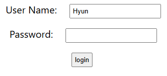

# 노트

## 1. React로 할 일 관리 앱 구축 시작하기
#### 투두 매니지먼트 앱 - 첫 스텝
1. Counter Example - 무엇을 배웠을까?
    * 컴포넌트 기본
        * View (JSX)
        * Styling (CSS)
        * State
        * Props
2. Todo 매니지먼트 앱 - 무엇을 배울까?
    * 라우팅
    * 폼
    * 데이터 검증
    * REST API 호출
    * 기본 인증, JWT 토큰 활용 인증
#### 컴포넌트
* Todo App 
    * Login Component
    * Welcome Component
    * Error Component
    * ListTodos Component
    * Header Component
    * Footer Component
    * Logout Component

## 2. 로그인 컴포넌트 시작하기 - Todo React 앱
#### Todo App 시작하기
1. Login Component
2. Welcome Component

* 모든 로직을 `TodoApp.jsx`에 작성한 뒤, 컴포넌트 분리 진행

`TodoApp.jsx`
```javascript
export default function TodoApp() {
    return(
        <div className="TodoApp">
            Todo Management Application
            <LoginComponent />
            {/* <WelcomeComponent /> */}
        </div>
    )
}

function LoginComponent() {
    return(
        <div className="Login">
            <div className="LoginForm">
                <div>
                    <label>User Name</label>
                    <input type="text" name="username" />
                </div>
                <div>
                    <label>Password</label>
                    <input type="password" name="password" />
                </div>
                <div>
                    <button type="button" name="login">login</button>
                </div>
            </div>
        </div>
    )
}

function WelcomeComponent() {
    return (
        <div className="Welcome">
            Welcome Componenet
        </div>
    )
}
```

## 3. 로그인 컴포넌트 개선

`TodoApp.jsx`
```javascript
// ... 생략 
function LoginComponent() {
    return(
        <div className="Login">
            <div className="LoginForm">
                <div>
                    <label>User Name:</label>
                    <input type="text" name="username" value="Hyun" />
                </div>
                <div>
                    <label>Password:</label>
                    <input type="password" name="password" />
                </div>
                <div>
                    <button type="button" name="login">login</button>
                </div>
            </div>
        </div>
    )
}
// ... 생략 
```
* `input` 태그의 `value`에 값을 입력하면, input에 자동으로 값이 채워지게 된다
* 하지만, 값을 바꾸려해도 바꿀수가 없다.
* 콘솔창에 제어할 수 없는 입력 값을 바꾸려고한다는 에러가 뜬다


#### 제어 컴포넌트
* 리액트에서 `input` 태그에 `value` 값 지정시, 그 값이 입력 필드에 반영되지만 직접 수정하는 것은 불가능하다. 이는 제어 컴포넌트에 해당하기 때문이다.
* 리액트에서 `Form` 요소를 다룰 때, 유의할 사항
    * 제어 컴포넌트
        * `useState`를 사용하여 입력 값을 상태로 관리
        * `value`를 상태 값으로 설정하고, `onChange` 핸들러를 통해 상태를 변경하여 입력 값 업데이트
    * 비 제어 컴포넌트
        * `useRef`를 사용하여 직접 DOM을 조작
        * `defaultValue`를 활용하여 초기 값만 설정하고, 이후에는 리액트 상태가 아닌 DOM이 관리

#### 개선하기
`TodoApp.jsx`
```javascript
// ... 생략 
function LoginComponent() {
    const [username, setUsername] = useState('Hyun')
    const [password, setPassword] = useState('')

    return(
        <div className="Login">
            <div className="LoginForm">
                <div>
                    <label>UserName:</label>
                    <input type="text" name="username" value={username} 
                    onChange={(e) => {setUsername(e.target.value)}}/>
                </div>
                <div>
                    <label>Password:</label>
                    <input type="password" name="password" value={password}
                    onChange={(e) => {setPassword(e.target.value)}}/>
                </div>
                <div>
                    <button type="button" name="login">login</button>
                </div>
            </div>
        </div>
    )
}
// ... 생략 
```
* `useState`로 username, password를 미리 설정한다
* 이를 `input` 태그의 `value` 값에 넣는다.
* `onChange` 핸들러, `useState`의 변경 함수를 이용하여 `input` 태그의 `value` 값을 실시간으로 변경한다.

## 4. 하드 코딩으로 인증 추가 - Todo React 앱

#### 사용자 인증을 추가해보자.
* 일단 하드코딩으로 인증을 진행한다.
* 나중에 Spring Security를 사용하여 인증 진행.

```javascript
function LoginComponent() {

    // ... 생략
    const [showSuccessMessage, setShowSuccessMessage] = useState(false)
    const [showErrorMessage, setShowErrorMessage] = useState(false)

    function handleSubmit() {
        if(username==='Hyun' && password ==='dummy') {
            setShowSuccessMessage(true)
            setShowErrorMessage(false)
        } else {
            setShowSuccessMessage(false)
            setShowErrorMessage(true)
        }
    }

    function SuccessMessageConponent() {
        if (showSuccessMessage === true) {
            return <div className='successMessage'>Authenticated Successfully</div>
        }
        return null
    }

    function ErrorMessageComponent() {
        if (showErrorMessage === true) {
            return <div className='errorMessage'>Authenticated Failed. Please check your credentials.</div>
        }
        return null
    }
    // ... 생략
    return(
        <div className="Login">
            <SuccessMessageConponent />
            <ErrorMessageComponent />
            <div className="LoginForm">
                {/* ... 생략 */}
                <div>
                    <button type="button" name="login" onClick={handleSubmit}>login</button>
                </div>
            </div>
        </div>
    )
}
```
* `useState`로 Message 상태를 관리한다 (true, false)
* `handleSubmit` 함수를 만든다 (특정 username, password에 true, false를 지정)
    * 이를 `button` 태그에 있는 `onClick`에 지정
* 성공, 에러 메시지를 띄우는 함수를 만든다 `SuccessMessageConponent`, `ErrorMessageComponent`

## 5. 로그인 컴포넌트에서 조건에 따른 메시지 표시 - Todo React 앱
* 이전 단계에서 `SuccessMessageConponent`, `ErrorMessageComponent` 두개의 함수를 만들어서 진행했었으나, `JSX` 형식으로 바로 적용시킬 수 있다.

`TodoApp.jsx`
```javascript
function LoginComponent() {

    // ... 생략
    const [showSuccessMessage, setShowSuccessMessage] = useState(false)
    const [showErrorMessage, setShowErrorMessage] = useState(false)

    function handleSubmit() {
        if(username==='Hyun' && password ==='dummy') {
            setShowSuccessMessage(true)
            setShowErrorMessage(false)
        } else {
            setShowSuccessMessage(false)
            setShowErrorMessage(true)
        }
    }

    return(
        <div className="Login">
            {/* showSuccessMessage, showErrorMessage 두개 각각 true일 때, 해당하는 jsx를 반환 */}
            {showSuccessMessage && <div className='successMessage'>Authenticated Successfully</div>}
            {showErrorMessage && <div className='errorMessage'>Authenticated Failed. Please check your credentials.</div>}
            <div className="LoginForm">
                {/* ... 생략 */}
                <div>
                    <button type="button" name="login" onClick={handleSubmit}>login</button>
                </div>
            </div>
        </div>
    )
}
```
* 불필요한 함수를 없애고, `{}`를 활용, JSX를 단순 반환하도록 할 수 있다.

## 6. React Router DOM으로 로그인 컴포넌트에 라우팅
* 이전 단계에서는 로그인에 대한 기능을 거의 완성한 상태
* 이제는 인증에 성공했을때 (로그인 정보가 맞을 때) `Welcome` 컴포넌트로 연결해주는 것이 필요하다. (라우팅)
* 라우팅을 위해서는 React Router DOM을 추가해야한다.

```terminal
npm install react-router-dom
```

`TodoApp`
```javascript
import { useState } from 'react';
import { BrowserRouter, Route, Routes, useNavigate } from 'react-router-dom';
import './TodoApp.css';

export default function TodoApp() {
    return(
        <div className="TodoApp">
            <BrowserRouter>
                <Routes>
                    <Route path='/' element={<LoginComponent />}></Route>
                    <Route path='login' element={<LoginComponent />}></Route>
                    <Route path='welcome' element={<WelcomeComponent />}></Route>
                </Routes>
            </BrowserRouter>
        </div>
    )
}

function LoginComponent() {
    // ... 생략
    const navigate = useNavigate();

    function handleSubmit() {
        if(username==='Hyun' && password ==='dummy') {
            setShowSuccessMessage(true)
            setShowErrorMessage(false)
            navigate('/welcome')
        } else {
            setShowSuccessMessage(false)
            setShowErrorMessage(true)
        }
    }
    return(
        // ... 생략
    )
}

function WelcomeComponent() {
    return (
        <div className="Welcome">
            Welcome Componenet
        </div>
    )
}
```
* `react-router-dom`을 설치
* `BrowserRouter`, `Routes`, `Route`를 이용하여 `path`와 `element`를 지정한다
    * path는 url 주소, element는 반환할 컴포넌트를 의미한다.
* `useNavigate` 메서드를 활용하여 함수를 불러오고, `navigate('/path')`를 지정
    * 이를 통해 로그인이 성공하면, Welcome 페이지로 이동하게 된다.

## 7. React 앱에 에러 컴포넌트 추가하기

#### 404에러 컴포넌트 추가하기.
`TodoApp.jsx`
```javascript
export default function TodoApp() {
    return(
        <div className="TodoApp">
            <BrowserRouter>
                <Routes>
                    <Route path='/' element={<LoginComponent />}></Route>
                    <Route path='/login' element={<LoginComponent />}></Route>
                    <Route path='/welcome' element={<WelcomeComponent />}></Route>
                    <Route path='*' element={<ErrorComponent />}></Route>
                </Routes>
            </BrowserRouter>
        </div>
    )
}
// ... 생략
function ErrorComponent() {
    return (
        <div className="Error">
            <h1>We are working really hard!</h1>
            <div>
                Apologies for the 404. Reach out to our team ar ABC-DEF-GHIJ.
            </div>
        </div>
    )
}
```
1. `ErrorComponent`를 만든다.
2. `Route` 태그의 `path` 옵션에 `*`을 이용, 지정한 페이지 이외에는 404 에러 컴포넌트가 뜨도록 진행한다.

## 8. 웰컴 컴포넌트에서 하드 코딩 삭제

#### useParams
* `LoginComponent`에서 URL 파라미터를 받아와 `WelcomeComponent`에서 사용하기
* `useParams`를 활용한다

#### 하드 코딩 삭제하기
`TodoApp.jsx > LoginComponent`
```javascript
function LoginComponent() {

    const [username, setUsername] = useState('Hyun')
    const [password, setPassword] = useState('')
    const [showSuccessMessage, setShowSuccessMessage] = useState(false)
    const [showErrorMessage, setShowErrorMessage] = useState(false)
    const navigate = useNavigate();

    function handleSubmit() {
        if(username==='Hyun' && password ==='dummy') {
            setShowSuccessMessage(true)
            setShowErrorMessage(false)
            navigate(`/welcome/${username}`)
        } else {
            setShowSuccessMessage(false)
            setShowErrorMessage(true)
        }
    }
    return(
        // ... 생략
    )
}
```
* `LoginComponent` 에서 navigate를 사용하고 있다, 여기서 `${username}`을 사용해 받아올 파라미터를 입력한다
    * `LoginComponent`의 `input`태그에 있는 username을 가져옴.

`TodoApp.jsx > TodoApp`
```javascript
export default function TodoApp() {
    return(
        <div className="TodoApp">
            <BrowserRouter>
                <Routes>
                    <Route path='/' element={<LoginComponent />}></Route>
                    <Route path='/login' element={<LoginComponent />}></Route>
                    <Route path='/welcome/:username' element={<WelcomeComponent />}></Route>
                    <Route path='*' element={<ErrorComponent />}></Route>
                </Routes>
            </BrowserRouter>
        </div>
    )
}
```
* `Route` 태그에 `path`를 활용, 파라미터로 받아올 url 파라미터를 지정 (`:username`)

`TodoApp.jsx > WelcomeComponent`
```javascript
function WelcomeComponent() {
    const param = useParams()
    return (
        <div className="Welcome">
            <h1>Welcome to {param.username}</h1>
            <div>Welcome Component</div>
        </div>
    )
}
```
* `useParams`를 변수에 지정, 해당 변수에 있는 username을 받아온다.
* 이를 통해, 로그인시 사용했던 username을 url파라미터로 받아와 변수로 지정할 수 있다.

## 9. 할 일 목록 컴포넌트 React로 만들기

`TodoApp.jsx > ListTodosComponent`
```javascript
function ListTodosComponent() {
    const todos = [
        {id:1, description: 'Learn AWS'},
        {id:2, description: 'Learn Full Stack Dev'},
        {id:3, description: 'Learn DevOps'},
    ]
    return (
        <div className="ListTodosComponent">
            <h1>Things You Want To do!</h1>
            <div>
                <table>
                    <thead>
                        <tr>
                            <td>id</td>
                            <td>description</td>
                        </tr>
                    </thead>
                    <tbody>
                        {
                            todos.map(
                                todo => (
                                    <tr key={todo.id}>
                                        <td>{todo.id}</td>
                                        <td>{todo.description}</td>
                                    </tr>
                                )
                            )
                        }
                    </tbody>
                </table>
            </div>
        </div>
    )
}
```
* `ListTodosComponent`를 만든다
* `map` 함수를 활용, 하드 코딩된 `todos`의 데이터를 넣어서 보여준다.


`TodoApp.jsx > TodoApp`
```javascript
export default function TodoApp() {
    return(
        <div className="TodoApp">
            <BrowserRouter>
                <Routes>
                    <Route path='/' element={<LoginComponent />}></Route>
                    <Route path='/login' element={<LoginComponent />}></Route>
                    <Route path='/welcome/:username' element={<WelcomeComponent />}></Route>
                    <Route path='/todos' element={<ListTodosComponent />} />
                    <Route path='*' element={<ErrorComponent />}></Route>
                </Routes>
            </BrowserRouter>
        </div>
    )
}
```
* `Route`에 `ListTodosComponent`를 넣어준다. `path`옵션은 `/todos`로 지정

## 10. 할 일 목록 컴포넌트에 상세 내용 보여주기
* 할 일 목록 컴포넌트에 완료 상태와 상세 내용을 하드코딩해서 보여줄 것이다.

#### `TodoApp.jsx > ListTodosComponent`
```javascript
function ListTodosComponent() {

    const today = new Date();
    const targetDate = new Date(today.getFullYear()+12, today.getMonth(), today.getDay())

    const todos = [
        {id:1, description: 'Learn AWS', done: false, targetDate:targetDate},
        {id:2, description: 'Learn Full Stack Dev', done: false, targetDate:targetDate},
        {id:3, description: 'Learn DevOps', done: false, targetDate:targetDate},
    ]
    return (
        <div className="ListTodosComponent">
            <h1>Things You Want To do!</h1>
            <div>
                <table>
                    <thead>
                        <tr>
                            <th>ID</th>
                            <th>Description</th>
                            <th>is Done?</th>
                            <th>Target Date</th>
                        </tr>
                    </thead>
                    <tbody>
                        {
                            todos.map((todo) => (
                                    <tr key={todo.id}>
                                        <td>{todo.id}</td>
                                        <td>{todo.description}</td>
                                        <td>{todo.done.toString()}</td>
                                        <td>{todo.targetDate.toDateString()}</td>
                                    </tr>
                                )
                            )
                        }
                    </tbody>
                </table>
            </div>
        </div>
    )
}
```
* `today` 변수를 Date, `targetDate` 변수를 연, 월, 일로 받아와서 미래시점으로 변경
* `todos` 배열에 완료 여부, targetDate 추가
* `map` 함수에 완료 여부를 `toString()` 메서드로 문자열로 반환
* `targetDate`를 `toDateString()` 메서드로 반환

#### `TodoApp.jsx > WelcomeComponent`
```javascript
import {Link} from 'react-router-dom';

function WelcomeComponent() {
    const param = useParams()
    return (
        <div className="Welcome">
            <h1>Welcome to {param.username}</h1>
            <div>
                Manage Your todos - <Link to='/todos'>Go here</Link>
            </div>
        </div>
    )
}
```
* `a` 태그 대신, `Link` 태그 사용
* `a` 태그는 전체 페이지가 새로고침됨 (서버에 새로운 요청)
    * `href` 속성으로 경로를 지정
* `Link` 태그는 새로고침 없이 페이지 이동, SPA 성능 최적화 (필요 부분만 업데이트)
    * `to` 속성으로 경로를 지정

## 11. 헤더, 바닥글, 로그아웃 컴포넌트 React로 만들기

#### 헤더 및 푸터 컴포넌트 만들기
`TodoApp.jsx > HeaderComponent, FooterComponent`
```javascript
function HeaderComponent() {
    return (
        <div className="header">
            Header <hr/>
        </div>
    )
}

function FooterComponent() {
    return (
        <div className="footer">
            <hr/> Footer
        </div>
    )
}
```
* 간단하게 헤더 및 푸터 컴포넌트를 만든다.

`TodoApp.jsx > TodoApp`
```javascript
export default function TodoApp() {
    return(
        <div className="TodoApp">
            <HeaderComponent />
            <BrowserRouter>
                <Routes>
                    <Route path='/' element={<LoginComponent />} />
                    <Route path='/login' element={<LoginComponent />} />
                    <Route path='/welcome/:username' element={<WelcomeComponent />} />
                    <Route path='/todos' element={<ListTodosComponent />} />
                    <Route path='*' element={<ErrorComponent />} />
                </Routes>
            </BrowserRouter>
            <FooterComponent />
        </div>
    )
}
```
* 이를 `TodoApp`에 적용한다.

#### 로그아웃 컴포넌트 만들기
* 위 방법과 동일하다

`TodoApp.jsx > LogoutComponent`
```javascript
function LogoutComponent() {
    return (
        <div className="LogoutComponent">
            <h1>You are logged out!</h1>
            <div>
                Thank you for using our App. Come back soon!
            </div>
        </div>
    )
}
```

`TodoApp.jsx > TodoApp`
```javascript
export default function TodoApp() {
    return(
        <div className="TodoApp">
            <HeaderComponent />
            <BrowserRouter>
                <Routes>
                    <Route path='/' element={<LoginComponent />} />
                    <Route path='/login' element={<LoginComponent />} />
                    <Route path='/welcome/:username' element={<WelcomeComponent />} />
                    <Route path='/todos' element={<ListTodosComponent />} />
                    <Route path='/logout' element={<LogoutComponent />} />
                    <Route path='*' element={<ErrorComponent />} />
                </Routes>
            </BrowserRouter>
            <FooterComponent />
        </div>
    )
}
```

## 12. React 프론트엔드 애플리케이션에 Bootstrap 추가

#### Bootstrap 사용하기
```terminal
npm install bootstrap
```

`index.js`에 import

`index.js`
```javascript
import 'bootstrap/dist/css/bootstrap.min.css';
```

`TodoApp.jsx > ListTodosComponent`
```javascript
function ListTodosComponent() {
    // ... 생략
    return (
        <div className="container">
            <h1>Things You Want To do!</h1>
            <div>
                <table className='table'>
                    {/* ... 생략 */}
                </table>
            </div>
        </div>
    )
}
```
* container, table 등 다양한 Bootstrap 기능을 사용할 수 있다.

## 13. Bootstrap을 사용하여 Todo React 프론트엔드 애플리케이션에 스타일 적용

`TodoApp.jsx > HeaderComponent`
```javascript
function HeaderComponent() {
    return (
        <header className="border-bottom border-light border-5 mb-5 p-2">
            <div className="container">
                <div className="row">
                    <nav className="navbar navbar-expand-lg">
                        <a className="navbar-brand ms-2 fs-2 fw-bold text-black" href="https://www.in28minutes.com">in28minutes</a>
                        <div className="collapse navbar-collapse">
                            <ul className="navbar-nav">
                                <li className="nav-item fs-5"><Link className="nav-link" to="/welcome/in28minutes">Home</Link></li>
                                <li className="nav-item fs-5"><Link className="nav-link" to="/todos">Todos</Link></li>
                            </ul>
                        </div>
                        <ul className="navbar-nav">
                            <li className="nav-item fs-5"><Link className="nav-link" to="/login">Login</Link></li>
                            <li className="nav-item fs-5"><Link className="nav-link" to="/logout">Logout</Link></li>
                        </ul>
                    </nav>
                </div>
            </div>
        </header>
    )
}
```

## 14. React 컴포넌트를 개별 JavaScript 모듈로 리팩토링

#### 모듈화
* 현재 `TodoApp.jsx` 파일에 컴포넌트가 다 있는 상태, 이를 모듈화 시켜줄 필요가 있다.

* `ErrorComponent.jsx`
* `FooterComponent.jsx`
* `HeaderComponent.jsx`
* `ListTodosComponent.jsx`
* `LoginComponent.jsx`
* `LogoutComponent.jsx`
* `WelcomeComponent.jsx`

## 15. 인증 컨텍스트로 React State를 여러 컴포넌트와 공유하기
* 현재 하드코딩 된 username, password를 활용하여 로그인을 진행하고 있다.
    * `LoginComponent.jsx`의 `handleSubmit()` 함수 참고
* 페이지를 이동하면, 이전 페이지에 있던 State는 바로 사라진다.
* 유저가 로그인 했다는 사실을 유지한 채로 헤더 컴포넌트에서 사용하고 싶음.
    * 사용자가 로그인 했다면, 로그인한 상태를 유지
    * 로그아웃 했다면 로그아웃 상태를 유지
    * 인증 관련 로직을 별도의 컴포넌트로 관리하는 것이 중요!

`security/AuthContext.js`
```javascript
import { createContext, useState } from "react";

export const AuthContext = createContext()

export default function AuthProvider({ children }) {

    const [number, setNumber] = useState(10)

    return (
        <AuthContext.Provider value={ {number} }>
            {children}
        </AuthContext.Provider>
    )
}
```
* `createContext`를 활용해서 context를 만든다
* `Provider`를 활용하여, React State를 공유한다.

`TodoApp.jsx`
```javascript
export default function TodoApp() {
    return(
        <div className="TodoApp">
            <AuthProvider>
                <BrowserRouter>
                    <HeaderComponent />
                        <Routes>
                            <Route path='/' element={<LoginComponent />} />
                            <Route path='/login' element={<LoginComponent />} />
                            <Route path='/welcome/:username' element={<WelcomeComponent />} />
                            <Route path='/todos' element={<ListTodosComponent />} />
                            <Route path='/logout' element={<LogoutComponent />} />
                            <Route path='*' element={<ErrorComponent />} />
                        </Routes>
                    <FooterComponent />
                </BrowserRouter>
            </AuthProvider>
        </div>
    )
}
```
* `AuthProvider`가 모든 컴포넌트를 다 감싸고 있다.

`HeaderComponent`
```javascript
import { Link } from "react-router-dom"
import { AuthContext } from "./security/AuthContext"
import { useContext } from "react"

export default function HeaderComponent() {

    const authContext = useContext(AuthContext)
    console.log(authContext.number)

    return (
        // ... 생략
    )
}
```
* `useContext`로 `AuthContext.js`에서 만든 Context를 사용
* Context에 있는 State를 다른 컴포넌트에서도 공유할 수 있다.

## 16. React State를 업데이트하고 인증 컨텍스트를 통해 확인
* 이전 단계에서 `useContext`를 활용하여 다른 컴포넌트에서도 State를 활용할 수 있도록 했다
* 하지만 좀 더 간단히 State 및 Context를 다른 컴포넌트로 전달할 수 있도록 수정해보자

`AuthContext.js`
```javascript
import { createContext, useContext, useState } from "react";

export const AuthContext = createContext()
export const useAuth = () => useContext(AuthContext)

export default function AuthProvider({ children }) {

    const [number, setNumber] = useState(10)

    return (
        <AuthContext.Provider value={ {number} }>
            {children}
        </AuthContext.Provider>
    )
}
```
* `createContext()`로 `AuthContext`를 만든다
* 화살표 함수 문법과 `useContext(AuthContext)`로 커스텀 훅을 만든다.
* Provider로 value를 지정, 10이라는 number 변수를 전달.

`HeaderComponent`
```javascript
import { Link } from "react-router-dom"
import { useAuth } from "./security/AuthContext"

export default function HeaderComponent() {

    const authContext = useAuth();
    console.log(authContext.number);

    return (
        // ... 생략
    )
}
```
* 사용하려는 컴포넌트에서는 `useAuth`만 import하여 조금 더 간단하게 State를 공유할 수 있다.

## 17. isAuthenticated를 React State에 설정 - 인증 컨텍스트
* 로그인을 하면 사용자가 인증되었다는 Context를 설정

`AuthContext.js`
```javascript
import { createContext, useContext, useState } from "react";

export const AuthContext = createContext()
export const useAuth = () => useContext(AuthContext)

export default function AuthProvider({ children }) {

    const [isAuthenticated, setAuthenticated] = useState(false)

    return (
        <AuthContext.Provider value={ {isAuthenticated, setAuthenticated} }>
            {children}
        </AuthContext.Provider>
    )
}
```
* `boolean` 값으로 `isAuthenticated`, `setAuthenticated`를 지정 (`useState`)

`LoginComponent`
```javascript
import { useState } from "react"
import { useNavigate } from "react-router-dom"
import { useAuth } from "./security/AuthContext"

export default function LoginComponent() {

    // ... 생략
    const authContext = useAuth();

    function handleSubmit() {
        if(username==='Hyun' && password ==='dummy') {
            authContext.setAuthenticated(true);
            setShowSuccessMessage(true)
            setShowErrorMessage(false)
            navigate(`/welcome/${username}`)
        } else {
            authContext.setAuthenticated(false);
            setShowSuccessMessage(false)
            setShowErrorMessage(true)
        }
    }
    return(
        // ... 생략
    )
}
```
* `handleSubmit` 함수에 `authContext`를 활용해서 `setAuthenticated` 함수를 로그인 여부에 따라 `boolean` 값을 부여한다.
* 이를 통해, 로그인에 성공하면 `Authenticated` 값은 `true`가 되고 실패하면 `false`값이 된다.

`HeaderComponent`
```javascript
import { Link } from "react-router-dom"
import { useAuth } from "./security/AuthContext"

export default function HeaderComponent() {

    const authContext = useAuth()
    const isAuthenticated = authContext.isAuthenticated;
    
    return (
        <header className="border-bottom border-light border-5 mb-5 p-2">
            <div className="container">
                <div className="row">
                    <nav className="navbar navbar-expand-lg">
                        <a className="navbar-brand ms-2 fs-2 fw-bold text-black" href="https://www.in28minutes.com">in28minutes</a>
                        <div className="collapse navbar-collapse">
                            <ul className="navbar-nav">
                                <li className="nav-item fs-5">
                                    {isAuthenticated 
                                        && <Link className="nav-link" to="/welcome/Hyun">Home</Link>}
                                </li>
                                <li className="nav-item fs-5">
                                    {isAuthenticated 
                                        && <Link className="nav-link" to="/todos">Todos</Link>}
                                </li>
                            </ul>
                        </div>
                        <ul className="navbar-nav">
                            <li className="nav-item fs-5">
                                {!isAuthenticated 
                                    && <Link className="nav-link" to="/login">Login</Link>}
                            </li>
                            <li className="nav-item fs-5">
                                {isAuthenticated
                                    && <Link className="nav-link" to="/logout" 
                                    onClick={() => {authContext.setAuthenticated(false)}}>
                                        Logout
                                        </Link>}
                            </li>
                        </ul>
                    </nav>
                </div>
            </div>
        </header>
    )
}
```
* `isAuthenticated`를 활용, 선택에 따라 `navbar`의 여부를 설정할 수 있다.
* `Logout` 버튼을 누르면 `onClick`함수를 활용, `setAuthenticated`를 `false` 값으로 지정한다.

#### 문제
* 로그아웃을 한 상태에서는 navbar에 `Todos` 메뉴는 보이지 않지만 url로 `/todos` 엔드포인트에 접근할 수 있게 된다
    * 즉, 로그인 & 로그아웃이 의미가 없어진다.

## 18. 인증 라우터로 React 라우터 보호하기 1
* 현재 인증 로직이 `LoginComponent`, `HeaderComponent`에 분산되어있다.
* 대부분의 인증 관련 로직을 AuthContext로 옮기는 작업을 진행.

`AuthContext.js`
```javascript
import { createContext, useContext, useState } from "react";

export const AuthContext = createContext()
export const useAuth = () => useContext(AuthContext)

export default function AuthProvider({ children }) {

    const [isAuthenticated, setAuthenticated] = useState(false)

    function login(username, password) {
        if(username==='Hyun' && password ==='dummy') {
            setAuthenticated(true);
            return true
        } else {
            setAuthenticated(false);
            return false
        }
    }

    function logout() {
        setAuthenticated(false);
    }

    return (
        <AuthContext.Provider value={ {isAuthenticated, login, logout} }>
            {children}
        </AuthContext.Provider>
    )
}
```
* `LoginComponent > handleSubmit()`의 로직을 가져와서 인증 로직을 가져온다
* `setAuthenticated`는 `AuthContext`에서만 활용할 예정이기 때문에, `AuthContext.Provider`의 `value` 값에서 제외

`LoginComponent`
```javascript
import { useState } from "react"
import { useNavigate } from "react-router-dom"
import { useAuth } from "./security/AuthContext"

export default function LoginComponent() {

    const [username, setUsername] = useState('Hyun')
    const [password, setPassword] = useState('')
    const [showErrorMessage, setShowErrorMessage] = useState(false)
    const navigate = useNavigate();
    const authContext = useAuth();

    function handleSubmit() {
        if(authContext.login(username, password)) {
            navigate(`/welcome/${username}`)
        } else {
            setShowErrorMessage(true)
        }
    }
    
    return(
        // ... 생략
    )
}
```
* `handleSubmit()` 함수를 경량화하여 메시지를 줄이고, `authContext.login()` 메서드를 활용하여 간단히 진행

`HeaderComponent`
```javascript
import { Link } from "react-router-dom"
import { useAuth } from "./security/AuthContext"

export default function HeaderComponent() {

    const authContext = useAuth()
    const isAuthenticated = authContext.isAuthenticated;
    const logout = authContext.logout;

    return (
        <header className="border-bottom border-light border-5 mb-5 p-2">
            <div className="container">
                <div className="row">
                    <nav className="navbar navbar-expand-lg">
                        <a className="navbar-brand ms-2 fs-2 fw-bold text-black" href="https://www.in28minutes.com">in28minutes</a>
                        <div className="collapse navbar-collapse">
                            <ul className="navbar-nav">
                                <li className="nav-item fs-5">
                                    {isAuthenticated 
                                        && <Link className="nav-link" to="/welcome/Hyun">Home</Link>}
                                </li>
                                <li className="nav-item fs-5">
                                    {isAuthenticated 
                                        && <Link className="nav-link" to="/todos">Todos</Link>}
                                </li>
                            </ul>
                        </div>
                        <ul className="navbar-nav">
                            <li className="nav-item fs-5">
                                {!isAuthenticated 
                                    && <Link className="nav-link" to="/login">Login</Link>}
                            </li>
                            <li className="nav-item fs-5">
                                {isAuthenticated
                                    && <Link className="nav-link" to="/logout" 
                                    onClick={logout}>
                                        Logout
                                        </Link>}
                            </li>
                        </ul>
                    </nav>
                </div>
            </div>
        </header>
    )
}
```
* `logout` 변수에 `authContext.logout` 지정하여 로그아웃 부분에 `onclick`을 `logout` 함수로 대체한다.

## 19. 인증 라우터로 React 라우터 보호하기 2
* 이전 단계에서의 한계점인 로그아웃을해도 URL 엔드포인트로 `/todos` 접근 가능한 것을 수정
* 인증 라우터를 만들어서 해결!

`TodoApp.jsx`
```javascript
function AuthenticatedRoute({children}) {
    const authContext = useAuth()

    if(authContext.isAuthenticated) 
        return children

    return <Navigate to="/" />
}

export default function TodoApp() {
    return(
        <div className="TodoApp">
            <AuthProvider>
                <BrowserRouter>
                    <HeaderComponent />
                        <Routes>
                            <Route path='/' element={<LoginComponent />} />
                            <Route path='/login' element={<LoginComponent />} />

                            <Route path='/welcome/:username' element={
                                <AuthenticatedRoute>
                                    <WelcomeComponent />
                                </AuthenticatedRoute>
                            } />
                       
                            <Route path='/todos' element={
                                <AuthenticatedRoute>
                                    <ListTodosComponent />
                                </AuthenticatedRoute>
                            } />
                            <Route path='/logout' element={
                                <AuthenticatedRoute>
                                    <LogoutComponent />
                                </AuthenticatedRoute>
                            } />

                            <Route path='*' element={<ErrorComponent />} />
                        </Routes>
                    <FooterComponent />
                </BrowserRouter>
            </AuthProvider>
        </div>
    )
}
```
* 만약에 `isAuthenticated`가 `true`라면, 자식 컴포넌트를 보여주고 아니라면 `Navigate`를 활용하여 `/` (로그인 페이지)로 이동
* `WelcomeComponent`, `ListTodosComponent`, `LogoutComponent`는 로그인 인증이 되어야 접근할 수 있도록 `AuthenticatedRoute` 컴포넌트로 감싼다.