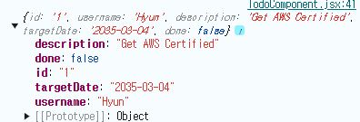

# 노트

## 1. React 풀 스택 애플리케이션을 위해 Todo REST API 프로젝트 설정하기
* REST API
    * Hello World REST API:
        * Hello World:
            * `@GetMaaping(path="/hello-world")`
        * Hello World Bean:
            * `@GetMaaping(path="/hello-world-bean")`
        * Hello World Path Variable:
            * `@GetMaaping(path="/hello-world/path-variable/{name}")`
    * Todo REST API
        * Retrieve Todos
            * `@GetMapping("/users/{username}/todos")`
        * Retrieve Todo 
            * `@GetMapping("/users/{username}/todos/{id}")`
        * Delete Todo
            * `@DeleteMapping("/users/{username}/todos/{id}")`
        * Update Todo
            * `@PutMapping("/users/{username}/todos/{id}")`
        * Create Todo
            * `@PostMapping("/users/{username}/todos")`

## 2. React Hello World 컴포넌트에서 Spring Boot Hello World REST API 호출하기

#### 리액트 애플리케이션에서 REST API 호출하기
`WelcomeComponent.jsx`
```javascript
import { useParams, Link } from "react-router-dom"

export default function WelcomeComponent() {
    const param = useParams()
    return (
        <div className="Welcome">
            <h1>Welcome to {param.username}</h1>
            <div>
                Manage Your todos - <Link to='/todos'>Go here</Link>
            </div>
            <div>
                <button className="btn btn-success m-5"
                    onClick={() => {
                        return console.log("called")
                    }}
                >
                    Call Hello World REST API
                </button>
            </div>
        </div>
    )
}
```
* REST API를 호출하기 위해 `button`을 추가하고, onClick 리스너를 붙인다.

#### Axios
* 리액트를 사용할 때, REST API를 호출하기 위해 가장 널리 사용하는 프레임워크

```terminal
npm install axios
```

`WelcomeComponent.jsx`
```javascript
import { useParams, Link } from "react-router-dom"
import axios from "axios";

export default function WelcomeComponent() {

    function callHelloWorldRestApi() {
        console.log('called')
        axios.get('http://localhost:8080/hello-world-bean')
    }
    // ... 생략
    return (
        // ... 생략
    )
}
```

* `axios`를 사용해서 API 호출을 할 때는 세 가지를 할 수 있다.
    * `then`, `finally`, `catch`


`WelcomeComponent.jsx`
```javascript
import { useParams, Link } from "react-router-dom"
import axios from "axios";

export default function WelcomeComponent() {

    function callHelloWorldRestApi() {
        console.log('called')
        axios.get('http://localhost:8080/hello-world')
            .then((response) => successfulResponse(response))
            .catch((error) => errorResponse(error))
            .finally(() => console.log('cleanup'))
    }

    function successfulResponse(response) {
        console.log(response)
    }

    function errorResponse(error) {
        console.log(error)
    }
    // ... 생략
    return (
        // ... 생략
    )
}
```
* `callHelloWorldRestApi` 정의
    * axios를 활용하여 get 메서드로 api를 불러온다.
* 만약에 성공한다면, `then`으로 `successfulResponse()` 메서드를 불러온다.
* 에러가 발생한다면, `catch`로 `errorResponse()` 메서드를 불러온다
* 마지막에는 콘솔에서 'cleanup' 이라는 문구를 프린트하게 한다.
* 결과적으로는 CORS 정책 때문에 불러오는 것이 차단되었다고 뜬다.


## 3. Spring Boot REST API에 대해 CORS 요청 활성화하기
#### CORS (Cross Origin Requests)
* 이전 단계에서 REST API를 호출하려 했으나, CORS 에러가 발생했다
* 이는 다른 도메인에서 오는 요청의 허용 여부를 결정하는 보안 기능
    * e.g. `localhost:3000`에서한 요청은 오직 `localhost:3000` 에서 와야 하는 것!

`RestfulWebServicesApplication.java`
```java
// ... 생략
@SpringBootApplication
public class RestfulWebServicesApplication {

	public static void main(String[] args) {
		SpringApplication.run(RestfulWebServicesApplication.class, args);
	}

	@Bean
	public WebMvcConfigurer corsConfigurer() {
		return new WebMvcConfigurer() {
			public void addCorsMappings(CorsRegistry registry) {
				registry.addMapping("/**")
						.allowedMethods("*")
						.allowedOrigins("http://localhost:3000");
			}
		};
	}
}
```
* `WebMvcConfigurer`: CORS 에러를 해결하기 위해서 `Spring MVC`에서 설정을 커스터마이징할 수 있는 인터페이스인 `WebMvcConfigurer`를 선언하여 configurer 객체를 생성
* `addCorsMappings`: CORS 관련 설정을 추가하는 메서드 (정의)
* `registry.addMapping("/**")`: 모든 URL 경로에 대해 CORS 설정을 적용
* allowedMethods("*"): 모든 HTTP 메서드 (`GET`,`POST`,`PUT`,`DELETE`)에 대해 CORS 요청을 허용 
* allowedOrigins("url"): 특정 경로에서 오는 요청만 허용 ("http://localhost:3000")

## 4. React에서 Spring Boot Hello World Bean과 패스 변수 REST API 호출하기

#### REST API 데이터 표출하기
* `useState()`를 활용한다
* 여기서는 hello-world, hello-world-bean 두 개의 경로의 JSON 데이터를 받아서 표출한다

```javascript
import { useParams, Link } from "react-router-dom"
import axios from "axios";
import { useState } from "react";

export default function WelcomeComponent() {

    const [message, setMessage] = useState(null)
    const [message2, setMessage2] = useState(null)

    function callHelloWorldRestApi() {
        console.log('called')
        axios.get('http://localhost:8080/hello-world')
            .then((response) => successfulResponse(response))
            .catch((error) => errorResponse(error))
            .finally(() => console.log('cleanup'))
    }

    function callHelloWorldBeanRestApi() {
        console.log('called')
        axios.get('http://localhost:8080/hello-world-bean')
            .then((response) => setMessage2(response.data.message))
            .catch((error) => console.log(error))
            .finally(() => console.log('cleanup'))
    }

    function successfulResponse(response) {
        console.log(response)
        setMessage(response.data)
    }

    function errorResponse(error) {
        console.log(error)
    }

    const param = useParams()
    return (
        <div className="Welcome">
            <h1>Welcome to {param.username}</h1>
            <div>
                Manage Your todos - <Link to='/todos'>Go here</Link>
            </div>
            <div>
                <button className="btn btn-success m-5"
                    onClick={callHelloWorldRestApi}
                >
                    Call Hello World REST API
                </button>
            </div>
            <div className="text-info">
                {message}
            </div>
            <div>
                <button className="btn btn-success m-5"
                    onClick={callHelloWorldBeanRestApi}
                >
                    Call Hello World Bean REST API
                </button>
            </div>

            <div className="text-info">
                {message2}
            </div>

        </div>
    )
}
```
* `useState(null)`로 데이터 초기값을 null로 초기화 한다
    * `setMessage` 함수로 데이터 response를 받아와서 대체할 예정
* `hello-world` 경로에 있는 response를 활용, `response.data`로 메시지를 표출한다
* `hello-world-bean` 경로에 있는 response를 활용, `response.data.message`로 메시지를 표출한다


## 5. Spring Boot REST API 호출 코드를 별도의 모듈에 리팩터링하기
#### REST API 호출의 세부적인 내용을 별도로 관리
* `src/components/todo/api` 폴더 생성
* `api` 폴더에 `HelloWorldApiService.js` 파일 생성
* REST API 호출 코드를 옮긴다.

`HelloWorldApiService.js`
```javascript
import axios from "axios";

// export function retrieveHelloWorldBean () {
//     return axios.get('http://localhost:8080/hello-world-bean')
// }

export const retrieveHelloWorldBean = () => axios.get('http://localhost:8080/hello-world-bean')
```
* `retrieveHelloWorldBean` 함수를 export
* 위의 함수를 사용해도되고, 화살표 함수를 사용한 것도 가능하다.


`WelcomeComponent.jsx`
```javascript
export default function WelcomeComponent () {
    // ... 생략
    function callHelloWorldBeanRestApi() {
        console.log('called')
        retrieveHelloWorldBean()
            .then((response) => setMessage2(response.data.message))
            .catch((error) => console.log(error))
            .finally(() => console.log('cleanup'))
    }
    // ... 생략
}
```
* 이전에 export한 `retrieveHelloWorldBean` 함수를 `axios.get()` 대신 사용


## 6. Spring Boot REST API에서 Axios를 사용하는 최적의 방식
#### REST API 호출 추가하기
`HelloWorldApiService.js`
```javascript
import axios from "axios";

const apiClient = axios.create(
    {
        baseURL: 'http://localhost:8080'
    }
)
// export function retrieveHelloWorldBean () {
//     return apiClient.get('http://localhost:8080/hello-world-bean')
// }

export const retrieveHelloWorldBean = () => apiClient.get('/hello-world-bean')

export const retrieveHelloWorldPathVariable = (username) => apiClient.get(`/hello-world/path-variable/${username}`)
```
* `axios.create()`를 활용하여 baseURL을 지정한다.
* path-variable 경로의 REST API 호출 추가
* username을 변수로 받아서 처리.

`WelcomeComponent.jsx`
```javascript
export default function WelcomeComponent () {
    // ... 생략
    function callHelloWorldPathVariable() {
        console.log('called')
        // 변수 추가
        retrieveHelloWorldPathVariable('Hyun')
            .then((response) => setMessage3(response.data.message))
            .catch((error) => console.log(error))
            .finally(() => console.log('cleanup'))
    }
    // ... 생략
}
```
* 일단 하드코딩으로 `retrieveHelloWorldPathVariable()`에 'Hyun' 이라는 변수를 추가해서 API 호출

## 7. Retrieve Todos Spring Boot REST API GET 메서드 

#### Todo 목록을 가져오기 위해 GET 메서드 만들기
`TodoResource`
```java
package com.in28minutes.rest.webservices.restfulwebservices.todo;

import org.springframework.web.bind.annotation.GetMapping;
import org.springframework.web.bind.annotation.PathVariable;
import org.springframework.web.bind.annotation.RestController;

import java.util.List;

@RestController
public class TodoResource {

    private TodoService todoService;

    // 생성자 주입
    public TodoResource(TodoService todoService) {
        this.todoService = todoService;
    }

    @GetMapping("/users/{username}/todos")
    public List<Todo> retrieveTodos(@PathVariable String username) {
        return todoService.findByUsername(username);
    }
}
```
* `Todo`에는 `id`, `username`, `description`, `targetDate`, `done`의 Getter, Setter, toString, 생성자가 있는 Class
* `TodoService`에는 `findByUsername`, `addTodo`, `deleteById`, `findById`, `updateTodo` 메서드가 존재
* `username`에 맞는 `Todo` 목록을 가져오기 위해 `TodoResource` 클래스를 만든다.
    * `http://localhost:8080/users/{username}/todos` 경로로 이동시, JSON 형태로 데이터가 반환되는 걸 확인할 수 있다.


## 8. React 앱에서 Spring Boot REST API로부터 Todo 표시하기
#### REST API를 활용하여 Todo 목록 표시

`TodoApiService.js`
```javascript
import axios from "axios";

const apiClient = axios.create(
    {
        baseURL: 'http://localhost:8080'
    }
)

export const retrieveAllTodosForUsername
    = (username) => apiClient.get(`/users/${username}/todos`)
```
* REST API 경로를 설정, username을 변수로 받기 때문에 해당 변수를 URL에 넣어준다.

`ListTodosComponent.jsx`
```javascript
import { useEffect, useState } from "react";
import { retrieveAllTodosForUsername } from "./api/TodoApiService";

export default function ListTodosComponent() {

    const [todos, setTodos] = useState([])

    useEffect (() => refreshTodos(), {})

    function refreshTodos() {
        
        retrieveAllTodosForUsername('Hyun')
        .then(response => {
            setTodos(response.data)
        })
        .catch(error => console.log(error))
    }

    return (
        // ... 생략
    )
}
```
* `useState()` 활용하여 todos를 가져온다.
* `retrieveAllTodosForUsername('Hyun')` 파라미터에 username을 하드코딩하여 데이터를 가져온다.
* `setTodos(response.data)`로 데이터들을 받아온다

## 9. Todo를 받고 삭제하는 Spring Boot REST API 메서드 만들기 
#### 특정한 Todo에 관한 세부정보를 받은 후, 해당 Todo를 삭제하는 법
* 특정한 Todo에 접근하여 삭제를 진행
`TodoResource.java`
```java
package com.in28minutes.rest.webservices.restfulwebservices.todo;

import org.springframework.web.bind.annotation.GetMapping;
import org.springframework.web.bind.annotation.PathVariable;
import org.springframework.web.bind.annotation.RestController;

import java.util.List;

@RestController
public class TodoResource {

    private TodoService todoService;

    // 생성자 주입
    public TodoResource(TodoService todoService) {
        this.todoService = todoService;
    }

    // ... 생략
    @GetMapping("/users/{username}/todos/{id}")
    public Todo retrieveTodo(@PathVariable String username, @PathVariable int id) {
        return todoService.findById(id);
    }

    @DeleteMapping("/users/{username}/todos/{id}")
    public ResponseEntity<Void> deleteTodo(@PathVariable String username, @PathVariable int id) {
        todoService.deleteById(id);
        return ResponseEntity.noContent().build();
    }
}
```
* Talend API Tester로 확인이 가능하다
* 응답이 `204 No Content`로 나온다
* 하지만 현재 `TodoService`에서 정적 리스트로 가져오는 것이기 때문에 삭제해도 금방 돌아온다. (의미가 없다.)

## 10. React 프론트엔드에 삭제 기능 추가하기
#### 삭제 기능을 추가하기 위해 id를 파라미터로 받아오는 함수 정의
`TodoApiService.js`
```javascript
import axios from "axios";

const apiClient = axios.create(
    {
        baseURL: 'http://localhost:8080'
    }
)
// ... 생략

export const deleteTodoApi
    = (username, id) => apiClient.delete(`/users/${username}/todos/${id}`)
```
* `deleteTodoApi`에서 `username`, `id`를 받아와서 `delete()` 메서드를 활용
* 해당 URL에 `DELETE` 메서드를 요청한다.

`ListTodosComponent.jsx`
```javascript
import { useEffect, useState } from "react";
import { retrieveAllTodosForUsername } from "./api/TodoApiService";

export default function ListTodosComponent() {

    // ... 생략
    function refreshTodos() {
        
        retrieveAllTodosForUsernameApi('Hyun')
        .then(response => {
            setTodos(response.data)
        })
        .catch(error => console.log(error))
    }

    function deleteTodo(id) {
        deleteTodoApi('Hyun', id)
        .then(() => {
                setMessage(`Delete of todo with ${id} successful`)
                refreshTodos()
            })
        .catch(error => console.log(error))
    }

    return (
    // ... 생략
        <tbody>
            {
                todos.map((todo) => (
                        <tr key={todo.id}>
                            <td>{todo.description}</td>
                            <td>{todo.done.toString()}</td>
                            <td>{todo.targetDate.toString()}</td>
                            <td><button 
                                    className="btn btn-warning" 
                                    onClick={() => deleteTodo(todo.id)}
                                >
                                    Delete
                                </button>
                            </td>
                        </tr>
                    )
                )
            }
        </tbody>
    // ... 생략
    )
}
```
* `deleteTodo`에서 `id`를 파라미터로 받은 후, Api에 `username`, `id`를 파라미터로 넣는다
    * `refreshTodos`는 삭제된 후의 목록을 반환하기 위한 목적.
* 삭제 버든을 만들고, `onClick` 으로 `deleteTodo()`에 파라미터에 `todo.id`를 지정
* 버튼을 클릭하면, id를 반환하는 것을 볼 수 있다.


## 11. username을 React 인증 컨텍스트에 설정하기
#### 인증 컨텍스트
* 로그인 시 username을 컨텍스트에 설정하여 이전에 하드코딩했던 부분을 대체한다
`AuthContext.js`
```javascript
import { createContext, useContext, useState } from "react";

export const AuthContext = createContext()
export const useAuth = () => useContext(AuthContext)

export default function AuthProvider({ children }) {

    // ... 생략

    const [username, setUsername] = useState(null)

    function login(username, password) {
        if(username==='Hyun' && password ==='dummy') {
            setIsAuthenticated(true)
            setUsername(username)
            return true
        } else {
            setIsAuthenticated(false)
            setUsername(null)
            return false
        }
    }

    // ... 생략

    return (
        <AuthContext.Provider value={ {isAuthenticated, login, logout, username} }>
            {children}
        </AuthContext.Provider>
    )
}
```
* `useState` 함수를 활용하여 초기값을 null 초기화
* `login` 함수의 `username === 'Hyun'` 부분을 이용하여 `setUsername` 진행
* Provider의 value로 username을 내보낸다

`ListTodoComponent.jsx`
```javascript
import { useEffect, useState } from "react";
import { deleteTodoApi, retrieveAllTodosForUsernameApi } from "./api/TodoApiService";
import { useAuth } from "./security/AuthContext";

export default function ListTodosComponent() {

    // const today = new Date();

    const authContext = useAuth()
    const username = authContext.username

    // const targetDate = new Date(today.getFullYear()+12, today.getMonth(), today.getDay(zzz))
    const [todos, setTodos] = useState([])
    const [message, setMessage] = useState(null)

    useEffect (() => refreshTodos(), {})

    function refreshTodos() {
        
        retrieveAllTodosForUsernameApi(username)
        .then(response => {
            setTodos(response.data)
        })
        .catch(error => console.log(error))
    }

    function deleteTodo(id) {
        deleteTodoApi(username, id)
        .then(() => {
                setMessage(`Delete of todo with ${id} successful`)
                refreshTodos()
            })
        .catch(error => console.log(error))
    }

    return (
        // ... 생략
    )
}
```
* 활용할 컴포넌트에 `useAuth`를 `import` 
* `username`을 `authContext`의 메서드인 `username`으로 초기화
* 기존에 'Hyun'으로 하드코딩했던 `retrieveAllTodosForUsernameApi()`, `deleteTodo()`의 파라미터에 `username`을 넣는다

## 12. Todo 페이지를 표시하기 위한 Todo React 컴포넌트 만들기
#### Todo 업데이트 기능 추가
`TodoComponent.jsx` 
```javascript
export default function TodoComponent() {
    return (
        <div className="container">
            <h1>Enter Todo Details</h1>
            <div>

            </div>
        </div>
    )
}
```
* 수정 기능을 추가하기 위해 새로운 컴포넌트 추가

`TodoApp.jsx`
```javascript
    <Route path='/todo/:id' element={
        <AuthenticatedRoute>
            <TodoComponent />
        </AuthenticatedRoute>
    } />
```
* `Route` 컴포넌트 추가
* `/todo/:id`를 이용하여 id 파라미터를 받도록 지정

`ListTodosComponent.jsx`
```javascript
import { useEffect, useState } from "react";
import { deleteTodoApi, retrieveAllTodosForUsernameApi } from "./api/TodoApiService";
import { useAuth } from "./security/AuthContext";
import { useNavigate } from "react-router-dom";

export default function ListTodosComponent() {
    // ... 생략
    function updateTodo(id) {
        console.log('clicked '+id)
        navigate(`/todo/${id}`)
    }

    return (
        <div className="container">
            <h1>Things You Want To do!</h1>
            {message && <div className="alert alert-warning">{message}</div>}
            <div>
                <table className='table'>
                    <thead>
                        <tr>
                            <th>Description</th>
                            <th>is Done?</th>
                            <th>Target Date</th>
                            <th>Delete</th>
                            <th>Update</th>
                        </tr>
                    </thead>
                    <tbody>
                        {
                            todos.map((todo) => (
                                    <tr key={todo.id}>
                                        <td>{todo.description}</td>
                                        <td>{todo.done.toString()}</td>
                                        {/* <td>{todo.targetDate.toDateString()}</td> */}
                                        <td>{todo.targetDate.toString()}</td>
                                        <td><button 
                                                className="btn btn-warning" 
                                                onClick={() => deleteTodo(todo.id)}
                                            >
                                                Delete
                                            </button>
                                        </td>
                                        <td>
                                            <button
                                                className="btn btn-success"
                                                onClick={() => updateTodo(todo.id)}
                                            >
                                                Update
                                            </button>
                                        </td>
                                    </tr>
                                )
                            )
                        }
                    </tbody>
                </table>
            </div>
        </div>
    )
}
```
* Update 버튼을 추가
* `useNavigate` > `navigate()` 메서드를 활용하여 `$id`를 파라미터로 전달한다.
* 이제 update 버튼을 누르면 해당 id의 파라미터를 받아서 todo의 수정 페이지로 이동할 수 있다.

`TodoApiService.js`
```javascript
import axios from "axios";

const apiClient = axios.create(
    {
        baseURL: 'http://localhost:8080'
    }
)
// ... 생략
export const retrieveTodoApi
    = (username, id) => apiClient.get(`/users/${username}/todos/${id}`)
```
* 수정시 필요한 description 등을 가져오기 위해 Api를 새로 만든다
* get 메서드 활용, 특정 id에 있는 데이터를 가져올 것이기 때문에 해당 주소를 활용한다.

`TodoComponent.jsx`
```javascript
import { useParams } from "react-router-dom"
import { retrieveTodoApi } from "./api/TodoApiService"
import { useAuth } from "./security/AuthContext"
import { useEffect, useState } from "react"

export default function TodoComponent() {

    const {id} = useParams() 
    
    const[description, setDescription] = useState('')

    const authContext = useAuth()
    
    const username = authContext.username

    useEffect(
        () => retrieveTodos(),
        [id]
    )

    function retrieveTodos() {
        retrieveTodoApi(username, id)
        .then(response => 
            setDescription(response.data.description)
        )
        .catch(error => console.log(error))
    }

    return (
        <div className="container">
            <h1>Enter Todo Details</h1>
            <div>
                description: {description}
            </div>
        </div>
    )
}
```
* `useParams`를 통해 id 파라미터를 받는다.
* `description`을 받아올 `useState()` 훅을 지정한다.
* 이전에 진행했던 `authContext`를 활용하여 `username`을 받아온다.
* `useEffect`메서드를 통해 `id` 값이 변경될 때마다 `retrieveTodos()` 함수를 호출하는 역할
    * 즉, `id`가 바뀔 때마다 해당 `id`에 해달하는 정보를 서버에서 가져와서 화면에 업데이트하는 역할


## 13. Todo React 컴포넌트를 표시하기 위해 Formik 및 Moment 라이브러리 추가하기
#### Formik
* React에서 `form`을 관리하는 라이브러리
* submit 자동 매핑 등 `form`을 자유롭게 사용할 수 있다.
```javascript
import { useParams } from "react-router-dom"
import { retrieveTodoApi } from "./api/TodoApiService"
import { useAuth } from "./security/AuthContext"
import { useEffect, useState } from "react"
import { Field, Form, Formik } from "formik"

export default function TodoComponent() {

    const {id} = useParams() 
    
    const[description, setDescription] = useState('')
    const[targetDate, setTargetDate] = useState('')

    const authContext = useAuth()
    
    const username = authContext.username

    useEffect(
        () => retrieveTodos(),
        [id]
    )

    function retrieveTodos() {
        retrieveTodoApi(username, id)
        .then(response => 
            {setDescription(response.data.description)
            setTargetDate(response.data.targetDate)}
        )
        .catch(error => console.log(error))
    }

    function onSubmit(values) {
        console.log(values)
    }

    return (
        <div className="container">
            <h1>Enter Todo Details</h1>
            <div>
                <Formik initialValues={{description, targetDate}}
                    enableReinitialize = {true}
                    onSubmit={onSubmit}
                >
                    {
                        (props) => (
                            <Form>
                                <fieldset className="form-group">
                                    <label>Description</label>
                                    <Field type="text" className="form-control" name="description" />
                                </fieldset>
                                <fieldset className="form-group">
                                    <label>Target Date</label>
                                    <Field type="date" className="form-control" name="targetDate" />
                                </fieldset>
                                <div>
                                    <button className="btn btn-success m-5" type="submit">Save</button>
                                </div>
                            </Form>
                        )
                    }
                </Formik>
            </div>
        </div>
    )
}
```
* `Formik` 라이브러리를 활용
* `fieldset` 태그를 사용하여 Input을 단드는 것!
* `initialValues`로 form의 초기값을 설정
    * 해당 초기 값은 useState로 관리된다
    * 기본적으로 `Formik`의 `initialValues`는 한 번만 설정되고 이후 업데이트가 되지 않는다.
* `enableReinitialize={true}` 옵션을 통해 `description`, `targetDate`가 변경될 때 Formik 값도 초기화 된다.
    * 즉 API에서 데이터를 가져와서 `setDescription()`, `setTargetDate()`를 호출하면 `Formik`의 값도 함께 변경된다.
* `onSubmit = {onSubmit}`을 통해 사용자가 Form을 submit 하면, `onSubmit()` 함수가 호출된다
    * 현재 코드에서는 `values`로 값을 받아서 입력된 값을 출력하는 역할을 한다.

## 14. Formik을 이용하여 Todo React 컴포넌트에 검증 추가하기
#### validate 옵션 활용하기
`TodoComponent`
```javascript
// ... 생략
    function retrieveTodos() {
        retrieveTodoApi(username, id)
        .then(response => 
            {setDescription(response.data.description)
            setTargetDate(response.data.targetDate)}
        )
        .catch(error => console.log(error))
    }

    function onSubmit(values) {
        console.log(values)
    }

    function validate(values) {
        let errors = {
            description: 'Enter a valid description'
        }
        console.log(values)
        return errors
    }
// ... 생략
```
* `validate`에서 `errors`를 return 한다면, `onSubmit()` 함수는 실행되지 않는다!
    * 즉 에러 발생 시, `onSubmit()` 함수는 실행되지 않는다.

```javascript
// ... 생략
    function validate(values) {
        let errors = {}

        if (values.description.length < 5) {
            errors.description = 'Enter at least 5 characters'
        }

        if (!values.targetDate) {
            errors.targetDate = 'Enter target date'
        }


        console.log(values)
        return errors
    }
return (
// ... 생략
    <Formik initialValues={{description, targetDate}}
        enableReinitialize = {true}
        onSubmit={onSubmit}
        validate={validate}
        validateOnChange={false}
        validateOnBlur={false}
    >
        {
            (props) => (
                <Form>
                    <ErrorMessage 
                        name = "description"
                        component="div"
                        className="alert alert-warning"
                    />

                    <ErrorMessage 
                        name = "targetDate"
                        component="div"
                        className="alert alert-warning"
                    />

                    <fieldset className="form-group">
                        <label>Description</label>
                        <Field type="text" className="form-control" name="description" />
                    </fieldset>
                    <fieldset className="form-group">
                        <label>Target Date</label>
                        <Field type="date" className="form-control" name="targetDate" />
                    </fieldset>
                    <div>
                        <button className="btn btn-success m-5" type="submit">Save</button>
                    </div>
                </Form>
            )
        }
    </Formik>
)
// ... 생략
```            
* `Formik`의 `ErrorMessage` 컴포넌트를 활용하여 에러메시지를 띄울 수 있다.
* `Formik`의 `validate` 옵션과 `validate()` 함수를 잘 확인하자
* `validate()`함수의 `values` 값을 활용하여 `description`의 길이가 5 미만이거나, `targetDate`의 `values`가 `null`이거나, `''` 일때 에러 메시지를 표출하게 할 수 있다 (응용이 가능하다.)
* `Formik`의 `validateOnChange`는 `Form`에 글자가 써질때마다 오류를 검증하는 것이다.
    * 비효율적이기 때문에 `false`
* `validateOnBlur`같은 경우는 입력 필드에 글자를 입력하다가 다른 곳을 클릭하면 검증을 시행 (포커스 아웃)
    * 폼을 제출할 때 검증을 하기 위해 `false`

## 15. Spring Boot 백엔드 API에 Todo 업데이트 및 생성 REST API 추가하기
#### PutMapping 추가하기
`TodoResource`
```java
@RestController
public class TodoResource {

    private TodoService todoService;

    // 생성자 주입
    public TodoResource(TodoService todoService) {
        this.todoService = todoService;
    }

    // ... 생략
    @PutMapping("/users/{username}/todos/{id}")
    public ResponseEntity<Void> updateTodo(@PathVariable String username, @PathVariable int id, @RequestBody Todo todo) {
        todoService.updateTodo(todo);
        return todo;
    }
}
```
* `PutMapping` 사용
* `username`, `id`, `Todo`를 받는다

#### PostMapping 추가하기
`TodoResource`
```java
@RestController
public class TodoResource {

    private TodoService todoService;

    // 생성자 주입
    public TodoResource(TodoService todoService) {
        this.todoService = todoService;
    }

    // ... 생략
    @PostMapping("/users/{username}/todos")
    public Todo createTodo(@PathVariable String username, @RequestBody Todo todo) {
        Todo createdTodo = todoService.addTodo(username, todo.getDescription(), todo.getTargetDate(), todo.isDone());
        return createdTodo;
    }
}
```
* `PostMapping` 사용
* Todo를 등록할 땐, id가 필요없기 때문에 삭제
    * `@RequestBody`로 `Todo(todo)`를 받아온 후, todo의 getter 메서드를 활용하여 `createTodo`를 만든다.
* `return`에 `createdTodo`로 지정

## 16. React 프론트엔드에 업데이트 기능 추가하기
#### API 추가
`TodoApiService.js`
```javascript
import axios from "axios";

const apiClient = axios.create(
    {
        baseURL: 'http://localhost:8080'
    }
)

export const retrieveAllTodosForUsernameApi
    = (username) => apiClient.get(`/users/${username}/todos`)

export const deleteTodoApi
    = (username, id) => apiClient.delete(`/users/${username}/todos/${id}`)

export const retrieveTodoApi
    = (username, id) => apiClient.get(`/users/${username}/todos/${id}`)

export const updateTodoApi
    = (username, id, todo) => apiClient.put(`/users/${username}/todos/${id}`, todo)
```

#### API 적용
`TodoComponent.jsx`
```javascript  
    function onSubmit(values) {
        const todo = {
            id: id, 
            username: username, 
            description: values.description,
            targetDate: values.targetDate,
            done: false
        }
        updateTodoApi(username, id, todo)
        .then(response => navigate('/todos')
        )
    }
```
* `onSubmit`의 `values` 값들을 활용
* id, username, values의 description, value의 targetDate, done 등을 설정하여 저장
* 업데이트가 적용되는 것을 볼 수 있다.



## 17. React 프론트엔드에 새로운 Todo 생성 기능 추가하기
#### 화면단에 생성 버튼 만들기

`ListTodosComponent.jsx`
```javascript
            <button className="btn btn-success m-3" onClick={addNewTodo}>
                Add New Todo
            </button>
```

#### create API 만들기
`TodoApiService.js`
```javascript
export const createTodoApi
    = (username, todo) => apiClient.post(`/users/${username}/todos`, todo)
```
* id는 필요 없음, 삭제

#### API 호출하기
`TodoComponent.jsx`
```javascript
    function retrieveTodos() {
        if (id != -1) {
            retrieveTodoApi(username, id)
            .then(response => 
                {setDescription(response.data.description)
                setTargetDate(response.data.targetDate)}
            )
            .catch(error => console.log(error))
        }
    }

    function onSubmit(values) {
        const todo = {
            id: id, 
            username: username, 
            description: values.description,
            targetDate: values.targetDate,
            done: false
        }
        if (id == -1) {
            createTodoApi(username, todo)
            .then(response => navigate('/todos'))
            .catch(error => console.log(error))
        } else {
            updateTodoApi(username, id, todo)
            .then(response => navigate('/todos'))
            .catch(error => console.log(error))
        }
    }
```
* id가 -1일때만 createTodoApi를 사용
* id가 -1이 아닐때를 기본으로 지정

## 18. Spring Security로 Spring Boot REST API 보호하기
#### Spring Security 의존성 추가
`pom.xml`
```
<dependency>
    <groupId>org.springframework.boot</groupId>
    <artifactId>spring-boot-starter-security</artifactId>
</dependency>
```
* 의존성 추가 후, `Talend API Tester`로 확인
* 인증 헤더를 추가해야한다.

`application.properties`
```
spring.security.user.name=Hyun
spring.security.user.password=dummy
```
* 추가하면, 기본 admin id와 password가 달라진다.

`BasicAuthenticationSecurityConfiguration.java`
```java
@Configuration
public class BasicAuthenticationSecurityConfiguration {

    @Bean
    public SecurityFilterChain filterChain(HttpSecurity http) throws Exception {
        return
            http
                .authorizeHttpRequests(
                // 모든 HTTP 요청이 인증이 되어야만 가능함.
                    auth -> auth.anyRequest().authenticated())
                // HTTP 기본 인증
                // 팝업 형태로 띄워줌
                .httpBasic(Customizer.withDefaults())
                // 상태가 없는 세션 만듦
                .sessionManagement(
                    session -> session.sessionCreationPolicy
                            (SessionCreationPolicy.STATELESS))
                // csrf를 해제
                .csrf().disable()
                .build();
    }
}
```